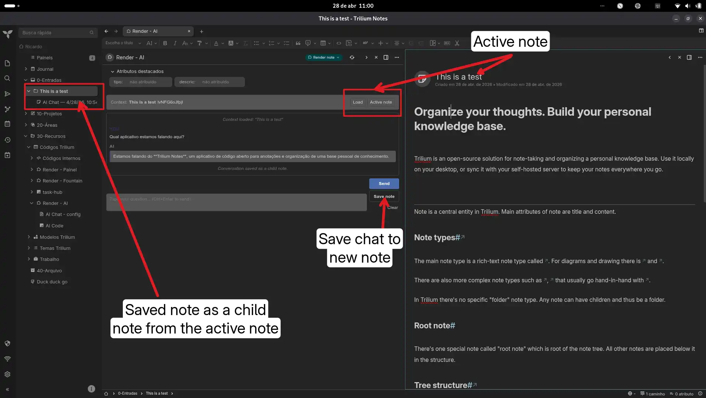
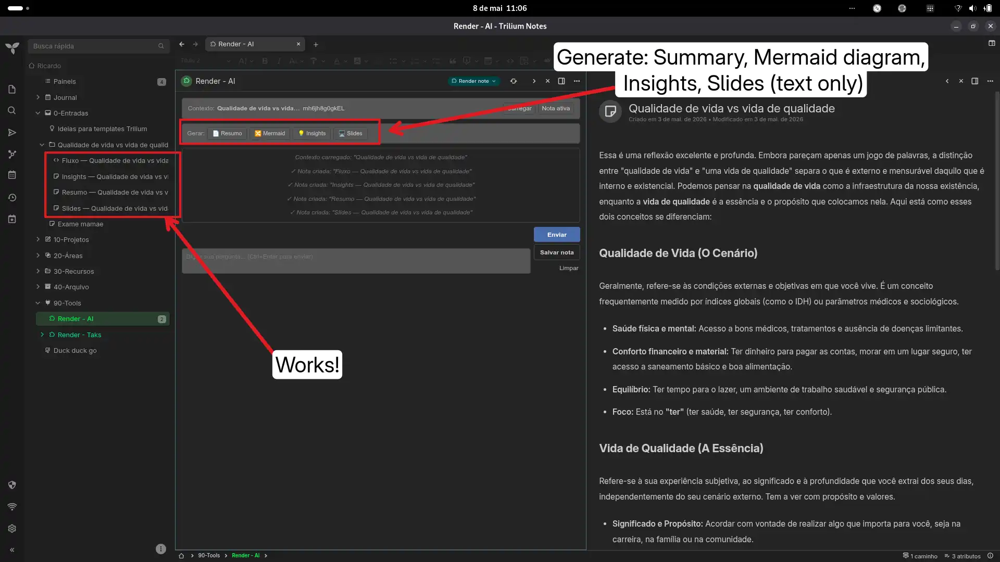

# AI Chat inside Trilium (No-Code Approach)

An experimental, command-driven AI chat interface built directly into Trilium Notes, using OpenRouter. 

## Features

* **Context-Aware:** Load any active note as the context for the AI prompt.
* **Simple RAG (Subnotes Tree):** Optionally include child and grandchild notes as context, toggled via checkbox. Tree traversal runs on the **backend** (reliable across all note types). Shows feedback on how many subnotes were included/skipped.
* **Quick Commands:**
  * `Resumo`: Generates a complete summary of the note (and subnotes if toggled), preserving links and bibliography.
  * `Mermaid`: Generates a Mermaid.js diagram (flowchart/mindmap) based on note relations.
  * `Insights`: Extracts key insights, open questions, and blind spots.
  * `Slides`: Generates an HTML-based slide presentation layout based on the text.
* **Save Conversations:** Easily save the chat log as a child note of your context note.
* **Stop Button:** Cancel a running request at any time.
* **Regenerate:** Re-roll any AI response.
* **Edit Messages:** Click to edit a sent message and re-send from that point.

## Setup Requirements

1. Import the plugin code as a `JS Frontend` note.
2. You must create a configuration note named `AI Chat - Config`.
3. Inside the config note, add your API keys in the text:
   `openrouter_key: YOUR_API_KEY_HERE`
   `model: anthropic/claude-3.5-sonnet` (or your preferred model).
   
   
### Images  

   
### Under the hood (recent)
- **Backend tree traversal** — `getNoteTree` moved to `api.runOnBackend()`; `getChildNotes()` now works reliably for all note types, including render notes and code notes
- **Unified char limit** — Both chat send and quick commands use `MAX_CTX_CHARS = 15000`; no more double-truncation
- **Subnote feedback** — Context now shows `[3/5 notas, 2 puladas]` so you know exactly how many child notes were included
- **Error visibility** — If a child note fails to load, it's logged and shown as `(erro ao ler filhas)` instead of silently disappearing

## Improvements

### UI / Layout
- **Markdown rendering** — AI responses render bold, code blocks, lists, tables, links, images, and blockquotes using `marked` + `DOMPurify` (CDN, graceful fallback to plain text)
- **Monochromatic icons** — All emoji replaced with Unicode symbols (`✎`, `▲`, `⌕`, `⎘`, `↻`, `⊡`, `◈`, etc.) — consistent in any theme
- **Message actions on hover** — Copy (`⎘`), Regenerate (`↻`), and Edit (`✎`) buttons appear on hover
- **Auto-resize textarea** — Input grows as you type (up to 180px)
- **Search within conversation** — Toggle filter to show/hide messages by text match
- **Timestamps** — Each message shows `HH:MM` alongside the label
- **Consecutive message grouping** — Repeated `VOCÊ` / `IA` labels are hidden; only timestamps separate consecutive same-author messages
- **Collapse long responses** — AI messages >1000 chars show "Mostrar mais" / "Mostrar menos" toggle
- **Message counter** — Live count of messages in the current conversation
- **Toast notifications** — Floating toasts for errors (red), info (blue), and copy confirmation — no chat pollution
- **Loading indicator** — "IA processando..." with `opacity: 0.6` during requests
- **Clear confirmation** — Confirm dialog before wiping the conversation (`Ctrl+Shift+C`)
- **Model badge** — Shows the current model (from config note) in the toolbar
- **Responsive** — Media query at 500px adjusts padding, font sizes, and layout for narrow panels

### Functionality
- **Simple RAG (Subnotes Tree)** — Checkbox "Subnotas" to recursively include child and grandchild notes as context. Tree depth and char limit configured via constants. Runs on the **backend** for reliability. Persisted in localStorage.
- **Stop Button** — During a request, the Send button turns into a red pulsing "Parar" button — click to abort via `AbortController`
- **Smart auto-scroll** — Only scrolls to bottom when the user is near the bottom (<120px); does not steal scroll position while reading history
- **Regenerate last response** — Click `↻` on any AI message to re-roll
- **Edit sent messages** — Click `✎` on a user message to edit and re-send; warns if subsequent history will be lost (`confirm()`)
- **Keyboard shortcuts** — `Ctrl+Enter` send, `Ctrl+Shift+C` clear, `Ctrl+Shift+S` save, `Ctrl+Shift+F` search
- **localStorage persistence** — History (last 100 messages), persona, system prompt, and subnotes toggle are saved and restored on reload
- **Config-driven model & parameters** — Model, temperature, and max_tokens read from config note (no UI dropdowns)
- **Protected note support** — Config loading tries `getProtectedContent()` then falls back to `getContent()` — secure your API key with Trilium's master password

### Security
- **Request timeout** — 90s timeout with `AbortController` on all API calls
- **Input validation** — Max 32000 characters per message
- **Structured error handling** — Distinguishes HTTP errors, API errors, timeouts, and network failures
- **Sanitized markdown** — DOMPurify strips malicious HTML before rendering

### Code Quality
- Clean architecture: most `alert()` calls replaced with toast notifications
- History index tracking for reliable edit/regenerate targeting
- Scroll position preserved during history restoration (`_isRestoring` flag)
