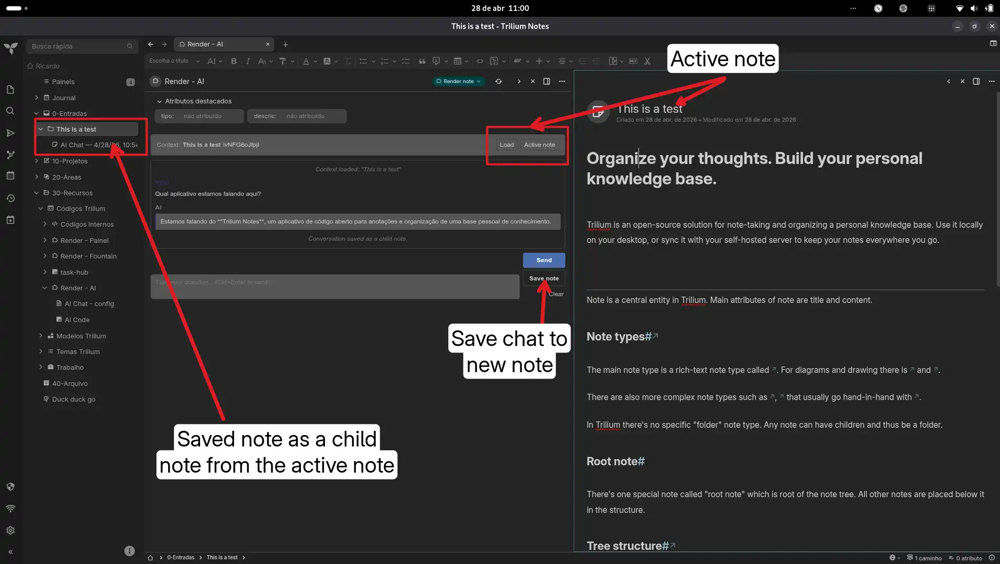
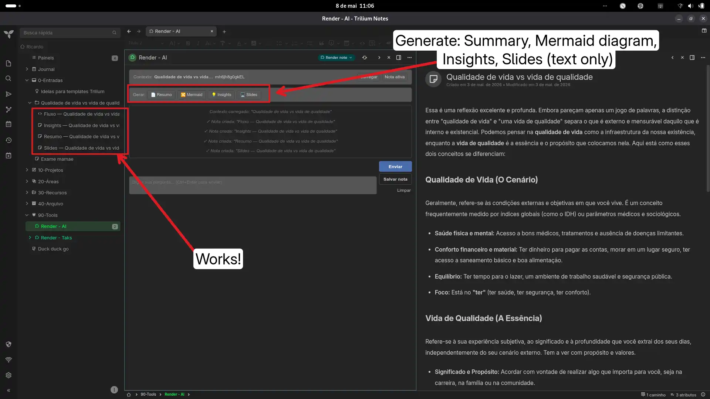

# AI Chat inside Trilium (No-Code Approach)

An experimental, command-driven AI chat interface built directly into Trilium Notes, using OpenRouter or any OpenAI-compatible provider.

## Features

* **Context-Aware:** Load any active note as the context for the AI prompt.
* **Simple RAG (Subnotes Tree):** Optionally include child and grandchild notes as context, toggled via checkbox. Tree traversal runs on the **backend** (reliable across all note types), skipping protected/archived/non-text notes. The context panel shows how many notes were included/skipped (`[3/5 notes, 2 skipped]`).
* **Quick Commands:**
  * `Summary`: Generates a complete summary of the note (and subnotes if toggled), preserving links and bibliography.
  * `Mermaid`: Generates a Mermaid.js diagram (flowchart/mindmap) based on note relations.
  * `Insights`: Extracts key insights, open questions, and blind spots.
  * `Slides`: Generates an HTML-based slide presentation layout based on the text.
* **Save Conversations:** Easily save the chat log as a child note of your context note.
* **Stop Button:** Cancel a running request at any time.
* **Regenerate:** Re-roll any AI response (the messages after it are replaced).
* **Edit Messages:** Load a sent message back into the input and re-send from that point (the following messages are removed after an inline confirmation).
* **Export:** Download the conversation as a Markdown file.
* **Bilingual UI:** PT-BR/EN following Trilium's interface language (`locale` option).

## Setup Requirements

1. Import the plugin (zip, Plugin Manager, or paste the code as a `JS Frontend` note).
2. You need a configuration note. The plugin finds it by the label **`#aiChatConfig`** — the Plugin Manager manifest creates it automatically as `AI Chat Config`. As a fallback it also accepts the titles `AI Chat - Config` / `AI Chat - config`.
3. Inside the config note, add your settings as plain text, one per line (`#` lines are ignored):

```text
openrouter_key: YOUR_API_KEY_HERE
model: deepseek/deepseek-v4-flash
# Optional:
# temperature: 0.7
# max_tokens: 4096
# api_base: https://api.deepseek.com/v1
```

If the config is missing or still has the `your key` placeholder, a banner appears at the top of the chat with a **Check again** button. The current model is shown in the toolbar badge.

### Supported providers (optional `api_base`)

By default the plugin uses OpenRouter. To use another provider, add `api_base:` pointing to any OpenAI-compatible API:

```text
# DeepSeek
api_base: https://api.deepseek.com/v1
model: deepseek-chat

# Groq (fast, free)
api_base: https://api.groq.com/openai/v1
model: llama3-70b-8192

# Together AI
api_base: https://api.together.xyz/v1
model: meta-llama/Llama-3.3-70B-Instruct-Turbo

# OpenAI
api_base: https://api.openai.com/v1
model: gpt-4o-mini

# OpenRouter (default — no api_base needed)
# model: openrouter/auto
# openrouter_key: sk-or-v1-...
```
   
   
### Images  



   
### Under the hood
- **Backend tree traversal** — `getNoteTree` runs in `api.runOnBackend()`; protected, archived and non-text notes are skipped, with per-note caps (40 notes / 2,000 chars each) before the 15,000-char context budget.
- **Single API path** — send/regenerate/commands share one `callApi()` with a per-operation `AbortController` and a 90 s timeout (`clearTimeout` in `finally`); the payload carries only `{role, content}` and the last ~40k chars of history.
- **Fail-closed markdown** — if `marked` or `DOMPurify` fails to load, the message is rendered as escaped text, never as raw HTML.
- **Scoped CSS** — all styles live under `.chat-wrap` and are hoisted into a single `#aic-chat-css` element (idempotent patch, no accumulation, no global reset).
- **Theme-aware** — danger colors, code blocks and borders adapt to light/dark themes (`.aic-light` detected from `--main-background-color`).
- **Config parser ignores comments** and validates/clamps `temperature` and `max_tokens`.

## Improvements

### UI / Layout
- **Markdown rendering** — AI responses render bold, code blocks, lists, tables, links, images, and blockquotes using `marked` + `DOMPurify` (CDN, graceful fail-closed fallback to escaped text)
- **Monochromatic icons** — UI glyphs are Unicode symbols (`✎`, `▲`, `⌕`, `⎘`, `↻`, `✕`, `⤓`), consistent in any theme
- **Message actions** — Copy (`⎘`), Regenerate (`↻`), and Edit (`✎`) buttons reveal on hover **and on keyboard focus** (`:focus-within`), with `aria-label`s
- **Auto-resize textarea** — Input grows as you type (up to 180px) with a char counter after 80% of the 32,000 limit
- **Search within conversation** — Toggle filter that shows `N of M` matches, searching the full text even in collapsed messages
- **Timestamps** — Each message shows `HH:MM` (locale-aware)
- **Consecutive message grouping** — Repeated `YOU` / `AI` labels are hidden; only timestamps separate consecutive same-author messages
- **Collapse long responses** — AI messages >1000 chars show "Show more" / "Show less" (no HTML slicing)
- **Message counter** — Live count of messages in the conversation
- **Toast notifications** — Floating toasts for errors, info, and copy confirmation (wrapping long API messages)
- **Loading indicator** — "AI is processing..." with `role="status"` and `aria-busy` on the message log
- **Inline confirmations** — Clearing the conversation, switching the context and editing a message ask for confirmation inline (no native `confirm()`), cancelable with the Cancel button
- **Model badge** — Shows the current model (loaded from the config note at boot)
- **Scroll helper** — Floating "scroll to bottom" button appears when you scroll up during a generation
- **Responsive** — Media query at 500px adjusts padding, font sizes (16px inputs to avoid iOS zoom) and touch targets (≥40px)

### Functionality
- **Simple RAG (Subnotes Tree)** — Checkbox "Subnotes" recursively includes child and grandchild notes as context; depth and caps configured via constants. Runs on the **backend** for reliability. Persisted in localStorage.
- **Stop Button** — During a request, the Send button turns into a red "Stop" button; click to abort via `AbortController`
- **Smart auto-scroll** — Only scrolls to bottom when the user is near the bottom (<120px)
- **Regenerate** — `↻` on any AI message re-rolls it (messages after it are discarded)
- **Edit sent messages** — Click `✎` (or the message bubble) to load the text back into the input
- **Keyboard shortcuts** — `Ctrl+Enter` send, `Ctrl+Shift+C` clear, `Ctrl+Shift+S` save, `Ctrl+Shift+F` search; scoped to the plugin (no longer steals shortcuts from other notes)
- **localStorage persistence** — History (last 100 messages), persona, system prompt, context note and subnotes toggle are saved and restored on reload (versioned state)
- **Config-driven model & parameters** — Model, temperature, and max_tokens read from the config note
- **Protected note support** — Config loading tries `getProtectedContent()` then falls back to `getContent()` — secure your API key with Trilium's master password
- **Error recovery** — Failed sends remove the dangling bubble and restore your text into the input; errors appear as persistent inline messages (with distinct timeout/canceled messages)

### Security
- **Fail-closed rendering** — no `marked`/`DOMPurify` means escaped text, never raw HTML (protects against CDN failures and prompt injection via note content)
- **Escaped persistence** — saved conversations and command outputs are HTML-escaped (commands sanitized with DOMPurify when available)
- **Request timeout** — 90s timeout with per-operation `AbortController`
- **Input validation** — Max 32,000 characters per message (Unicode-aware count)
- **Structured error handling** — Distinguishes HTTP errors, API errors, timeouts, cancellations, and network failures
- **Backend scan filters** — Protected/archived/non-text notes are never read into context

### Code Quality
- Clean architecture: shared `callApi()`, inline confirmations and toasts instead of `alert()`/`confirm()`
- State versioning (`STORAGE_VERSION`) with validation of restored history
- Bilingual strings (`AIC_I18N` + `tr()`) in PT/EN; timestamps and note titles follow the locale
- Stable message ids (`mid`) for reliable edit/regenerate targeting

## Tests

```bash
bun test-chat.js    # pure functions: escaping, config parser + structural guards
bun test-smoke.js   # Chrome headless: boot (config/no-config/EN), send, network error, search
```
