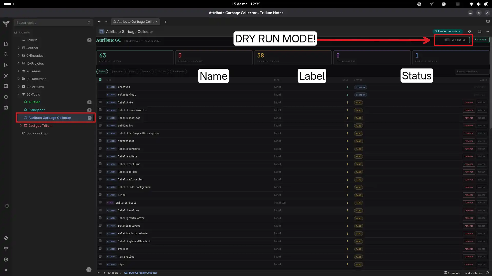
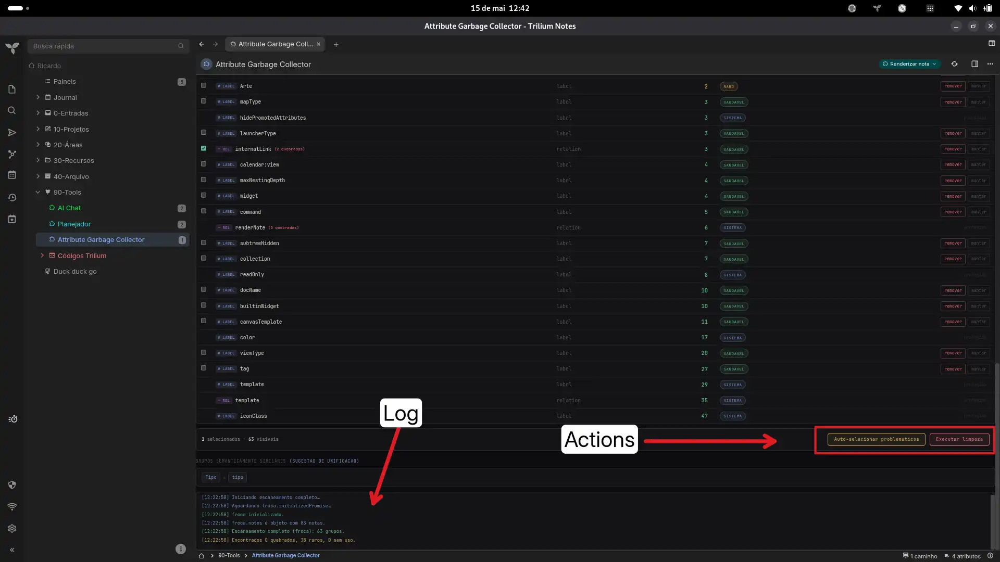

# Attribute GC — TriliumNext Maintenance Tool

A garbage collector for TriliumNext attributes. Scans all notes to find broken relations, unused labels, rare attributes, and near-duplicate names. Lets you preview and safely delete them — either individually or in batch.

## Features

- **Full scan** — Reads all notes via `froca` (TriliumNext frontend cache) or `api.runOnBackend` (classic Trilium). Classifies every label and relation by usage count and health.
- **Broken relation detection** — Finds relations pointing to deleted or missing target notes.
- **Rare attribute flagging** — Highlights attributes used ≤2 times, plus temp/draft/test patterns.
- **Semantic duplicate finder** — Uses Levenshtein distance to surface near-identical names (`pipeline` vs `pipelne`, `autor` vs `autores`).
- **Dry run mode** — Toggle on to preview what would be deleted without making changes.
- **Batch operations** — Auto-select all problematic attributes, then delete them in one click.
- **Scoped CSS** — All styles are prefixed under `#attrgc-root` so nothing leaks into the Trilium UI.

---

## 🌐 Language / Idioma

**Note on language:** Since I am from Brazil, the interface and text within this tool are currently in **Brazilian Portuguese (PT-BR)**. 
However, you can easily translate them to English or your preferred language by simply opening the code files inside Trilium and replacing the text strings.

---

## How it works

### Scan (read)

```
glob.getActiveContextNote() → froca → froca.notes / froca.attributes
```

The note accesses TriliumNext's frontend object cache directly. All notes and their attributes are already in memory — no backend calls needed.

### Delete (write)

```
note.getOwnedAttributes(type, name) → attr.update({ isDeleted: true })
```

Finds attribute objects on each note via the standard prototype method, then marks them deleted through the entity's own `update()` method. The change syncs to the backend automatically.

For **relations**, only broken instances (target note missing or deleted) are removed. For **labels**, all instances of that name are removed.

### Classic Trilium fallback

If `api.runOnBackend` is available (classic Trilium), the tool uses SQL for scanning and `removeLabel` / `removeRelation` for deletion.

## Installation

1. In TriliumNext, import the .zip file (the plugin) into any root note of your choice (e.g., Tools, Plugins, or Add-ons).

2. The import contains two notes: a Render note and an HTML code note. Simply click on the Render note to view the panel.

## Usage

1. Click **Escanear** — the tool reads all notes and shows a dashboard of attribute stats.
2. Use the filter tabs (**Quebrados**, **Raros**, **Sem uso**, **Sistema**) and search bar to narrow down.
3. Click **Auto-selecionar problemáticos** to check all non-system problematic attributes, or tick individual checkboxes.
4. **Toggle Dry Run OFF** (the yellow banner disappears).
5. Click **Executar limpeza** → confirm the dialog. The tool removes the selected attributes.
6. A green banner flashes briefly, and a re-scan runs to confirm the new counts.

The individual **remover** button on each row works the same way — skips the batch dialog.

## Protected attributes

These system/internal attributes are locked and cannot be deleted:

`template`, `workspace`, `iconClass`, `cssClass`, `run`, `runOnInstance`, `runAtStartup`, `shareAlias`, `shareHiddenFromTree`, `archived`, `pinned`, `bookmarked`, `weight`, `color`, `renderNote`, `child`, `runOnNoteCreation`, `noteType`, `mime`, `shareCss`, `shareJs`, `shareRaw`, `shareDisallowRobotIndexing`, `keyboardShortcut`, `label`, `relation`, `promoted`, `multiplicity`, `labelDefinition`, `relationDefinition`, `toc`, `readOnly`, `excludeFromExport`, `appCss`, `appTheme`, `sorted`, `sortDirection`, `sortFoldersFirst`, `top`, `hide`, `hidePromotedAttributes`, `disableVersioning`, `calendarRoot`, `dateNote`, `datePattern`, `inbox`, `sqlConsole`, `searchHome`, `hoistedNote`, `similarNotes`, `versioningLimit`, `mapRootNoteId`, `system`, `root`

## Compatibility

| Environment | Scan | Delete |
|---|---|---|
| **TriliumNext** | `froca.notes` | `attr.update({ isDeleted: true })` |
| **Classic Trilium** | `api.sql.getRows` | `note.removeLabel` / `note.removeRelation` |
| **Browser (demo)** | Mock data | Simulated (noop) |

## Technical notes

- The tool renders as a **Render Note** in TriliumNext — no build step, no dependencies.
- All CSS is scoped under `#attrgc-root` to prevent style conflicts with the Trilium UI.
- The delete path uses `getOwnedAttributes(type, name)` (prototype method on `FNote`) to retrieve attribute objects, then calls `update({ isDeleted: true })`. No raw SQL modifications — all changes go through the entity lifecycle.
- Broken relations are detected by building a `Set` of all valid `noteId`s and checking whether a relation's target exists in that set.

## License

MIT

### Images  



