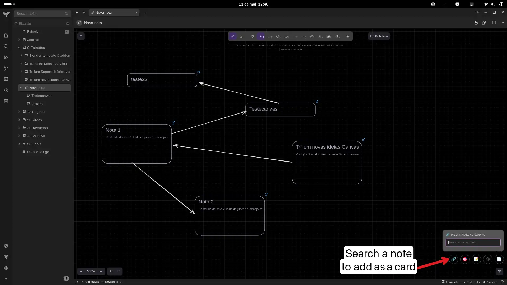
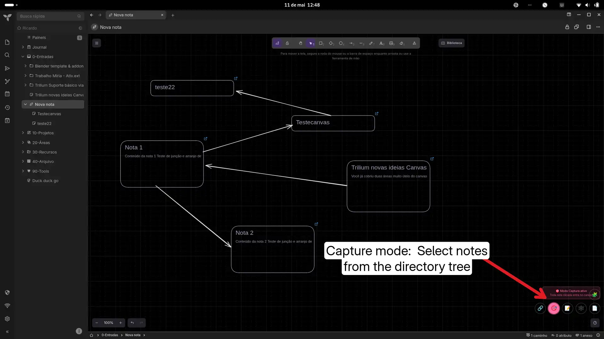
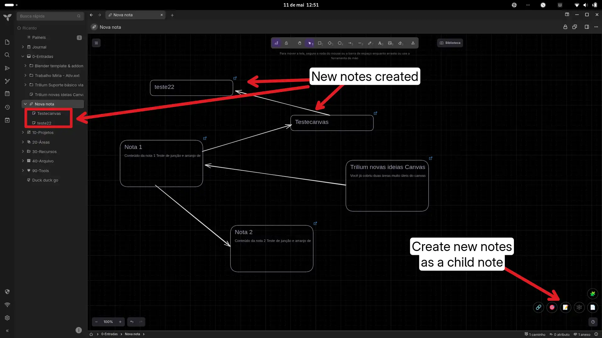
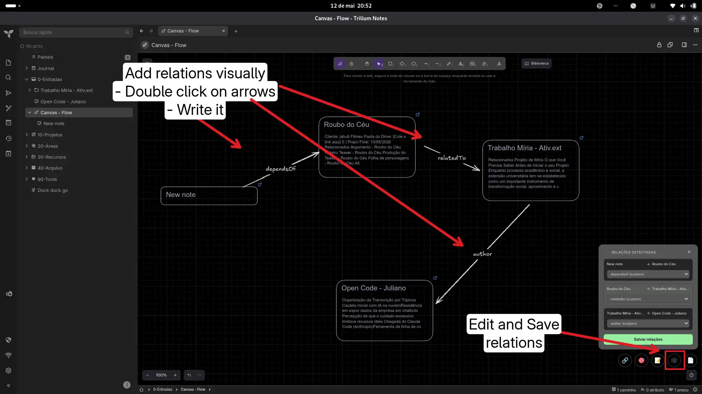
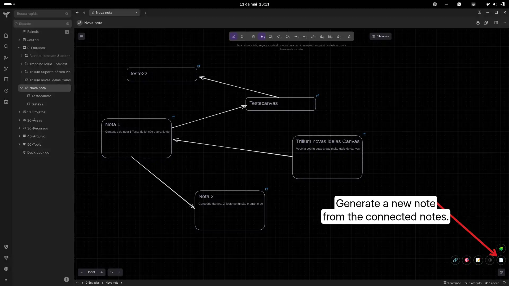

# Canvas Note Tools

A custom Canvas workflow for TriliumNext focused on visual thinking, writing flow, and longform organization. It acts as a bridge between visual thinking, non-linear outlining, and knowledge management.

## Features

* **🎯 Capture Mode:** Toggle the target button to freely navigate your directory tree. Every note you click is automatically inserted as a canvas card.
* **🔍 Quick Search Popup:** Instantly find and insert notes directly onto your canvas using a floating search window.
* **✨ Create on the Fly:** Draft and add new notes directly within your canvas.
* **✏️ Establish Relations:** Define relations directly by double-clicking arrows and typing.
* **↔️ Synthesize Knowledge:** Generate comprehensive, long-form documents automatically by combining your canvas cards. The arrow-based ordering system ensures perfect narrative flow.
* **⚡ Local & Fast:** A lightweight, fully local system with a clean floating UI.

## Installation

1. Create a new note of type `JS Frontend`.
2. Add the label: `#widget`.
3. Paste the full code or import the `.zip` release.
4. Reload TriliumNext (`F5`).

## Usage
Open any Canvas note. Use the `🔗` button to search, the `🎯` button to capture from the tree, the `📝` button to create a new note, `🕸️` button to edit relacions( popup menu ) and the `📄` button to synthesize your document based on the flow of your Excalidraw arrows.

## Original link
[https://github.com/orgs/TriliumNext/discussions/9668](https://github.com/orgs/TriliumNext/discussions/9668)

### Images  

