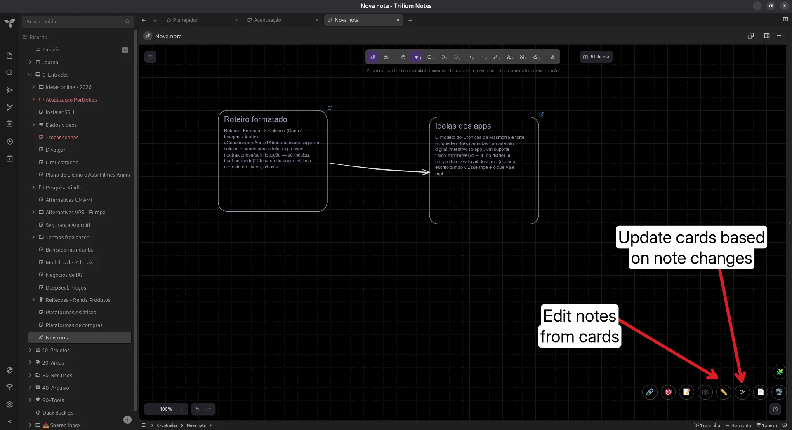
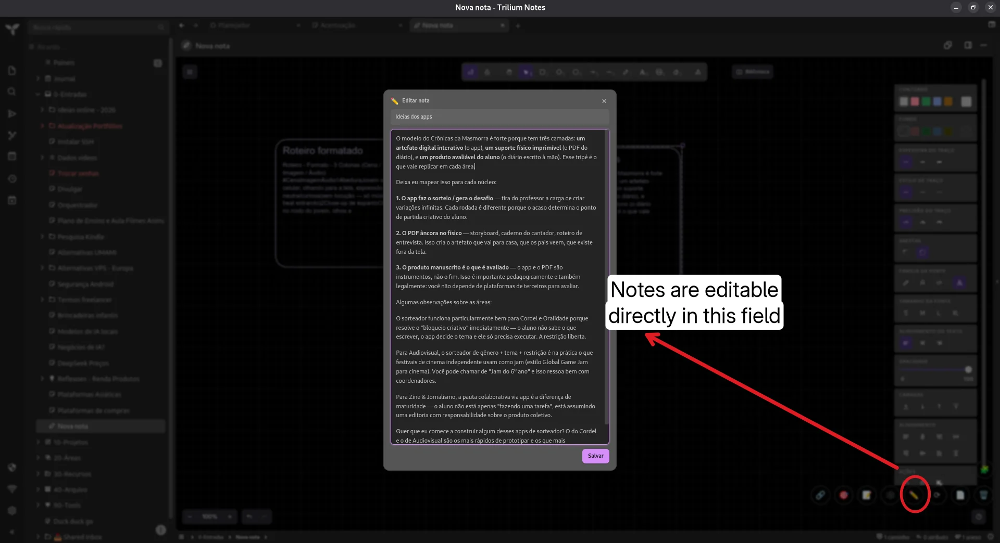

# Canvas Note Tools

A custom Canvas workflow for TriliumNext focused on visual thinking, writing flow, and longform organization. It acts as a bridge between visual thinking, non-linear outlining, and knowledge management.

## Features

* **🔍 Quick Search:** Find and insert notes directly onto your canvas using a floating search window.
* **🎯 Capture Mode:** Toggle to navigate your tree — every note clicked is inserted as a card. Persists across reloads via `sessionStorage`.
* **📝 Create on the Fly:** Draft and add new child notes without leaving the canvas.
* **✏️ Floating Editor:** Edit any card's linked note without leaving the canvas. The editor opens centered as a floating window with the note's title and HTML content (`contenteditable`). Closing saves directly to the note and refreshes the card.
* **⟳ Sync Cards:** Regenerate all cards from their linked notes in one click. Title and excerpt are refreshed from the current note content (no comparison — always updates).
* **🕸️ Smart Relations:** Detects arrow connections between cards. Auto-detects relation types from text written on arrows (`inspira`, `contradiz`, etc.) and updates labels on save.
* **🗑️ Remove Cards:** List all linked cards and remove individual ones directly from the canvas.
* **📄 Longform Synthesis:** Generate comprehensive documents by combining canvas cards in arrow-based order (topological sort).
* **⌨️ Keyboard:** Press `Escape` to dismiss any open panel. Click outside panels to close them.
* **⚡ Local & Fast:** Lightweight, fully local, clean floating UI with glass-morphism design.

## Installation

1. Create a new note of type `JS Frontend`.
2. Add the label: `#widget`.
3. Paste the full code or import the `.zip` release.
4. Reload TriliumNext (`F5`).

## Usage
Open any Canvas note. Use the floating toolbar:

| Button | Action |
|---|---|
| 🔗 | Search and insert notes into the canvas |
| 🎯 | Toggle capture mode (click notes in the tree) |
| 📝 | Create a new child note and insert as card |
| 🕸️ | Detect and edit relations from arrow connections |
| ✏️ | List cards and edit the linked note in a floating editor |
| ⟳ | Sync all cards from their linked notes |
| 🗑️ | List and remove cards from the canvas |
| 📄 | Generate longform document from card order |

### Floating Editor (✏️)

1. Click the ✏️ button → a panel lists all cards linked to notes
2. Click **Edit** on a card → a floating editor opens centered on screen
3. Edit the title and content (HTML preserved via `contenteditable`)
4. Close (✕) or click **Save** → the note is saved and the card text is refreshed automatically

### Sync Cards (⟳)

Regenerates the title and excerpt of **every** card directly from its linked note. Use this when you edited notes outside the canvas (opening them normally) and want the cards up to date. It always updates (no diff) and keeps card positions intact.

## Original link
[https://github.com/orgs/TriliumNext/discussions/9668](https://github.com/orgs/TriliumNext/discussions/9668)

### Images  

