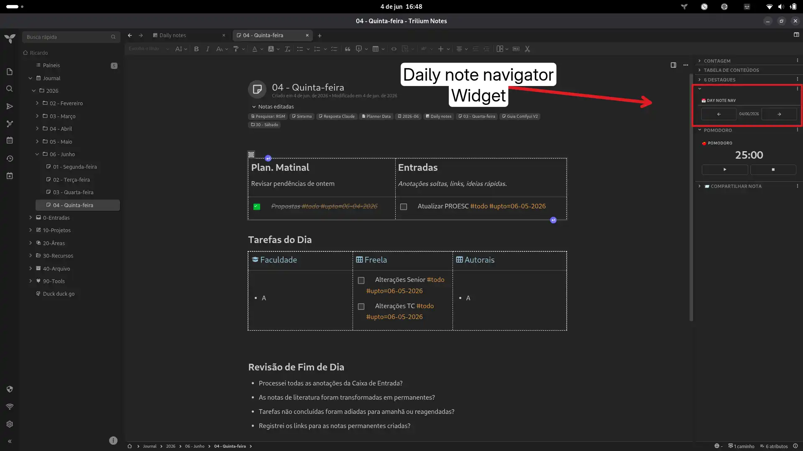

# 📅 Daily Note Navigator

A right-pane widget for TriliumNext that adds **previous / next day** navigation buttons when viewing a daily journal note (`#dateNote`).

## Features

- ← → buttons and **arrow keys** to navigate between daily notes
- « » buttons to jump between months
- 📅 button to instantly return to today
- Shows the current date in `DD/MM/YYYY` format
- Inline notifications when no note exists for a given day
- Day cache for instant navigation (no repeated backend calls)
- Automatically hides when the active note is not a day note
- Lightweight — zero dependencies

## Installation

### Via Plugin Manager

1. Open the Plugin Manager
2. Find **Daily Note Navigator**
3. Click **Install**

### Manual

1. Create a Code note with MIME `application/javascript;env=frontend`
2. Paste the contents of `Daily-Note-Navigator.js`
3. Add the label `#widget`
4. Reload the interface

## Usage

Open any note that has a `#dateNote` label (daily journal notes created via Trilium's calendar/journal feature). The navigation bar appears in the right pane.

| Control | Action |
|---------|--------|
| ← / → buttons | Previous / next day |
| ← / → arrow keys | Previous / next day |
| « / » buttons | Previous / next month |
| 📅 button | Return to today |

Days you visit are cached, so navigating back is instant.

## Labels

| Label | Where | Purpose |
|-------|-------|---------|
| `#widget` | On the widget note | Registers as a right-pane widget |
| `#dateNote` | On daily notes (auto) | Triggers the navigator to appear |

## Screenshots

