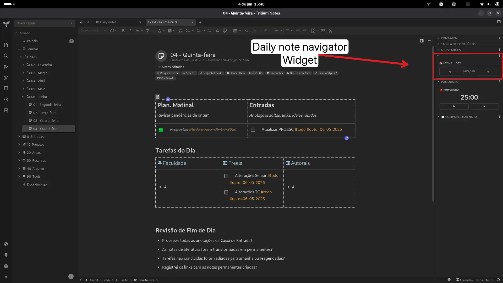

# 📅 Daily Note Navigator

A right-pane widget for TriliumNext that adds **previous / next day** navigation buttons when viewing a daily journal note (`#dateNote`).

## Features

- **Read-only navigation:** ← → buttons (and arrow keys) move between daily notes; « » jump between months. The widget **never creates notes by itself**.
- **Missing days:** when there is no note for the target day, an inline notice appears with a **Create note** button (the only place a note is created, on your explicit action).
- **Keyboard (scoped to the widget):** with the focus inside the bar, `←`/`→` change days, `PageUp`/`PageDown` change months and `t` goes to today — it does **not** steal arrows from the note editor or the note tree.
- **Date label:** shows the target date with the short weekday (`dom 20/09/2026` / `Sun 09/20/2026`), follows the interface language and marks the current day (`aria-current="date"`).
- **Locale-aware:** PT/EN UI following Trilium's `locale`.
- **Day cache:** days already visited open instantly (bounded cache of 60 entries).
- **Errors:** failed navigation shows an inline error and re-enables the buttons.
- **Accessible:** `role="group"` bar with `aria-label`, buttons with `aria-label`, live region for the date/notices, 40px targets (44px on small panels), `:focus-visible`, `prefers-reduced-motion` and theme-aware colors.

## Installation

### Via Plugin Manager

1. Open the Plugin Manager
2. Find **Daily Note Navigator**
3. Click **Install**

### Manual

1. Create a Code note with MIME `application/javascript;env=frontend`
2. Paste the contents of `Daily-Note-Navigator.js`
3. Add the label `#widget`
4. Reload the interface

## Usage

Open any note that has a `#dateNote` label (daily journal notes created via Trilium's calendar/journal feature). The navigation bar appears in the right pane.

| Control | Action |
|---------|--------|
| ← / → buttons | Previous / next day |
| ← / → keys (focus in the bar) | Previous / next day |
| « / » buttons | Previous / next month (day clamped to the month length) |
| PageUp / PageDown (focus in the bar) | Previous / next month |
| 🗓 / `t` | Return to today |

Days you visit are cached, so navigating back is instant. If a day has no note, use the **Create note** action in the notice.

## Labels

| Label | Where | Purpose |
|-------|-------|---------|
| `#widget` | On the widget note | Registers as a right-pane widget |
| `#dateNote` | On daily notes (auto) | Triggers the navigator to appear |

## Notes & limitations

- Date math is done with local components (no UTC drift): at 22:00 in UTC-3 the "today" button still opens the current day.
- The widget only appears for notes with a valid `#dateNote` (ISO date); the panel card may stay visible (header only) outside daily notes depending on the layout.
- The day lookup is a read-only search (`#dateNote="YYYY-MM-DD"`); notes are created only through the explicit action.

## Tests

```bash
bun test-dnn.js      # pure date math (run also with TZ=America/Sao_Paulo and TZ=Pacific/Auckland)
bun test-smoke.js    # Chrome headless: read-only navigation, create action, scoped keyboard, today state, EN
```

## Screenshots


