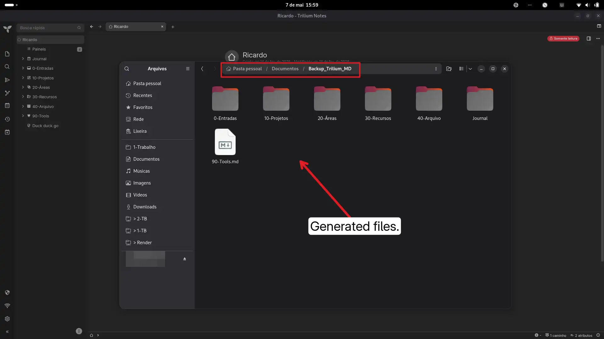

# Trilium Incremental Markdown Backup

A lightweight, incremental backup tool for [TriliumNext](https://github.com/TriliumNext/Notes) that exports your notes as individual Markdown (`.md`) files.

Instead of exporting your entire vault every time, this script queries the ETAPI to download **only the notes that have been modified** since the last run. Large vaults are backed up in seconds after the initial full export.

No plugins or Node.js required—just a single Python script, the Trilium ETAPI, and a cron job.

---

## 🚀 Features

* **Incremental Backups:** Skips notes whose `dateModified` hasn't changed since the last backup timestamp.
* **Folder Hierarchy:** Automatically organizes your `.md` files into folders that mirror your Trilium note tree.
* **Smart Filenames:** Saves files as `Note Title [note_id].md` to completely prevent name collisions (e.g., when two notes share the same title in the same folder).
* **Multi-Type Support:** Backs up `text`, `code`, `mermaid`, `file`, and `image` notes out of the box.
* **YAML Frontmatter:** Each `.md` file includes a frontmatter block with `trilium_id`, `created`, and `modified` timestamps, making it easy to diff versions or re-import later.
* **Resilient:** Features an automated retry queue. If a note fails to download (e.g., network error), it gets logged in the state file and is automatically reprocessed on the next run.
* **Fast:** Utilizes an in-memory metadata cache to drastically reduce redundant API calls when building hierarchical folder paths.

---

## 📋 Requirements

### System (Debian/Ubuntu)

```bash
sudo apt update
sudo apt install python3 python3-pip

```

### Python Libraries

The script requires the `requests` library:

```bash
pip install requests --break-system-packages

```

> **Note:** On Ubuntu 23+ or Debian 12+, the `--break-system-packages` flag is required if installing globally. Alternatively, use a virtual environment:
> ```bash
> python3 -m venv .venv
> source .venv/bin/activate
> pip install requests
> 
> ```
> 
> 

---

## ⚙️ Setup

1. Clone this repository or download the `trilium_backup_incremental.py` script.
2. Edit the three configuration variables at the top of the script to match your environment:

```python
SERVER     = "http://localhost:8080"           # Your Trilium server address
TOKEN      = "YOUR_ETAPI_TOKEN"                # Settings → ETAPI → Generate token
BACKUP_DIR = Path("/home/youruser/Backup_MD")  # Your destination folder

```

*(To get your ETAPI token in TriliumNext: Go to `Menu → Options → ETAPI` and click **Generate new token**).*

---

## 💻 Usage

### First Run (Full Backup)

On its first execution, the script fetches all supported notes and builds the local directory structure.

```bash
python3 trilium_backup_incremental.py

```

**Example Output:**

```text
First backup — exporting all notes...
347 note(s) to process...
  [1/347] saved: Home
  [2/347] saved: Journal
  ...
✓ Completed: 347 note(s) saved, 0 skipped.
Backup at: /home/youruser/Backup_MD

```

### Subsequent Runs (Incremental)

On later runs, the script checks the hidden `.backup_state.json` file and only fetches what has changed (plus any previously failed downloads).

**Example Output:**

```text
Last backup: 2026-04-20T14:32:00.123456+00:00
Searching for notes modified since then...
12 note(s) to process...
  [1/12] saved: Meeting notes 2026-04-21
  [2/12] no changes: Home
  ...
✓ Completed: 1 note(s) saved, 11 skipped.

```

---

## 📁 Backup Folder Structure

```text
Backup_MD/
├── .backup_state.json               ← internal state file & retry queue (hidden)
├── Home [abc123XYZ].md
├── Journal/
│   ├── 2026-04-20 [def456UVW].md
│   └── 2026-04-21 [ghi789RST].md
├── Projects/
│   ├── Project A [jkl012MNO].md
│   └── Project B [pqr345LMN].md
└── ...

```

**Inside each `.md` file:**

```markdown
---
title: "Meeting notes 2026-04-21"
trilium_id: ghi789RST
created: 2026-04-21 09:00:00.000Z
modified: 2026-04-21 11:32:00.000Z
---

Note content here...

```

---

## ⏱️ Scheduling Automatic Backups (Cron)

To run a backup every day at 2:00 AM, open your crontab:

```bash
crontab -e

```

Add the following line (adjusting paths to match your system):

```cron
0 2 * * * python3 /home/youruser/scripts/trilium_backup_incremental.py >> /home/youruser/trilium_backup.log 2>&1

```

The `>> ...log 2>&1` portion captures all script output into a log file so you can review your backup history.

---

## ⚠️ Notes and Limitations

* **Text-focused:** Backs up `text`, `code`, and `mermaid` notes. Canvas notes, renderNotes, relation maps, and other non-text elements are skipped.
* **Files:** `file` and `image`-type notes are backed up as binary files with the same naming convention. Configurable via `BACKUP_FILES = True/False` in the script.
* **Attachments:** Embedded attachments (files linked inside text notes) are not downloaded. Only standalone `file`/`image` notes are supported.
* **HTML → Markdown conversion:** Trilium stores text notes internally as HTML. The script performs a basic conversion (handling headings, paragraphs, and line breaks).
* **Append-only:** The script currently does not delete local `.md` files if the corresponding note is deleted inside Trilium.

---

### Screenshots

