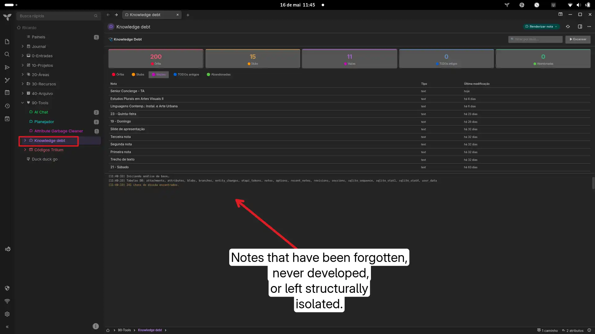

# 🩺 Knowledge Debt — TriliumNext Plugin

A **Render Note** dashboard that audits the health of your knowledge base, surfacing notes that have been forgotten, never developed, or left structurally isolated.

---

## What it detects

| Category | Criteria |
|---|---|
| 🔴 **Orphans** | No other note links to them (no backlinks) |
| 🟠 **Stubs** | Text content between 1–250 characters, no children |
| 🟣 **Empty** | Null or blank content, no children (containers excluded) |
| 🔵 **Old TODOs** | Has a `#todo`-style label, unmodified for > 30 days |
| 🟢 **Abandoned** | No children, unmodified for > 90 days |

Collection notes and any note acting as a container (i.e. notes with children) are automatically excluded from **Stubs** and **Empty** to avoid false positives.

---

## Installation

1. Create a new **JS Frontend** note and paste the contents of `knowledge-debt.js`
2. Create a second note (any type) — this will be your dashboard page
3. On the dashboard note, add the relation attribute:
   ```
   ~renderNote = <your JS note>
   ```
4. Open the dashboard note and click **▶ Escanear**

---

## Compatibility

Tested on **TriliumNext** (post-Trilium fork). The plugin auto-detects the internal links table name across different versions (`note_links`, `links`, etc.) and falls back gracefully to relation attributes if no links table is found. All available tables are logged after each scan for debugging.

---

## Thresholds

All thresholds are defined directly in the SQL queries and easy to adjust:

```js
// Stubs: notes shorter than this (in raw HTML characters) are flagged
LENGTH(b.content) BETWEEN 1 AND 250

// Old TODOs: flagged after this many days without modification
julianday('now') - julianday(n.dateModified) > 30

// Abandoned: flagged after this many days without modification
julianday('now') - julianday(n.dateModified) > 90
```

---

## Credits

Inspired by the `attribute-gc` plugin pattern. Built as a companion tool for PKM maintenance workflows in TriliumNext.

Licensed under MIT.


### Screenshot


