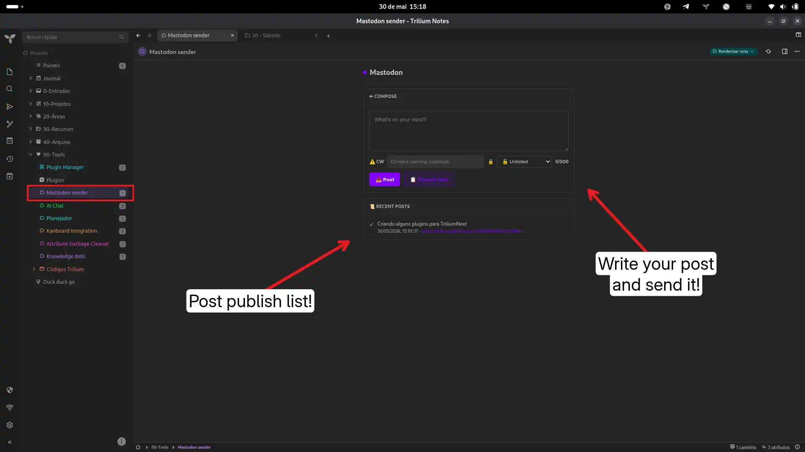

# Mastodon Sender — TriliumNext Plugin

Post to Mastodon directly from TriliumNext. Compose toots, set visibility and content warnings, and post your current note — all without leaving your knowledge base.

## How it works

```
[Trilium Frontend] → api.runAsyncOnBackendWithManualTransactionHandling()
    → POST /api/v1/statuses → Bearer token → Mastodon instance
```

A single JS Frontend render note. No external dependencies, no ZIP imports.

## Features

- **Compose** — write toots in a comfortable textarea with character counter
- **Multiple accounts** — configure several Mastodon instances and switch between them
- **Visibility selector** — Public, Unlisted, Followers only, or Direct
- **Content warning** — optional CW/spoiler field
- **Post current note** — one-click to grab the active note's title and content
- **Post history** — last 20 posts stored locally, with account and links
- **Theme-aware** — blends with any Trilium theme via CSS variables
- **Clean UI** — same design language as the Kanboard Sync plugin

## Prerequisites

- **TriliumNext** (any recent version)
- A **Mastodon account** on any instance (bolha.us, usal.zone, mastodon.social, etc.)
- An **access token** with `read write` scope

### Getting an access token

1. Go to your Mastodon instance → **Preferences** → **Development**
2. Click **New Application**
3. Give it a name (e.g., "Trilium Sender")
4. Enable scopes: `read write` (both required)
5. Submit, then copy the access token

## Installation

### 1. Create the notes

Create **2 notes** in Trilium:

| Note | Type | MIME | Instructions |
|------|------|------|--------------|
| `ms Sender` | Script | `application/javascript;env=frontend` | Paste `Mastodon_Sender.js` content |
| `Mastodon Sender` | Text | — | Leave blank (your dashboard) |

### 2. Set up the render relation

On **Mastodon Sender**, add:
```
~renderNote = ms Sender
```

### 3. Configure

Edit the `CONFIG` at the top of **ms Sender**:

```javascript
const CONFIG = {
  accounts: [
    { name: 'Bolha',     instance: 'https://bolha.us',  token: 'YOUR_TOKEN' },
    { name: 'Usal Zone', instance: 'https://usal.zone', token: 'YOUR_TOKEN' },
  ],
};
```

Add as many accounts as you want. Switch between them via the dropdown in the header.

### 4. Open the dashboard

Open the **Mastodon Sender** note. Compose and post!

## Usage

### Post a toot
1. Write your message in the textarea
2. Optionally set a **content warning** and **visibility**
3. Click **Post**

### Post the current note
1. Open the note you want to share
2. Switch to the **Mastodon Sender** dashboard
3. Click **Current note** — title and content are loaded into the composer
4. Review, edit, and post

## Mastodon API used

| Method | Endpoint | Description |
|--------|----------|-------------|
| `POST /api/v1/statuses` | Create a toot | `{ status, visibility, spoiler_text }` |

Full API docs: [docs.joinmastodon.org](https://docs.joinmastodon.org/methods/statuses/#create)

## File structure

```
Mastodon-Sender/
├── README.md
├── manifest.json
└── Mastodon_Sender.js   ← JS Frontend note (all logic)
```

## Troubleshooting

| Issue | Likely cause | Solution |
|-------|-------------|----------|
| "Connection failed" | Wrong instance URL | Make sure `CONFIG.instance` starts with `https://` and has no trailing slash |
| HTTP 401 / 403 | Invalid token | Generate a new token with `read write` scope |
| HTTP 422 | Toot too long or empty | Keep under 500 characters |
| Blank dashboard | Missing `~renderNote` | Add `~renderNote = ms Sender` |

## License

MIT

## Screencapture

