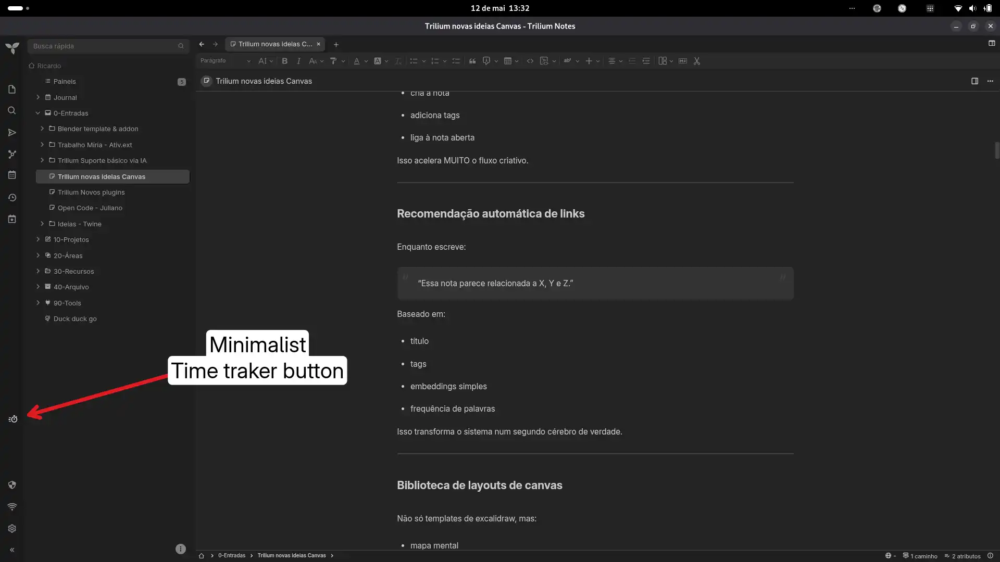
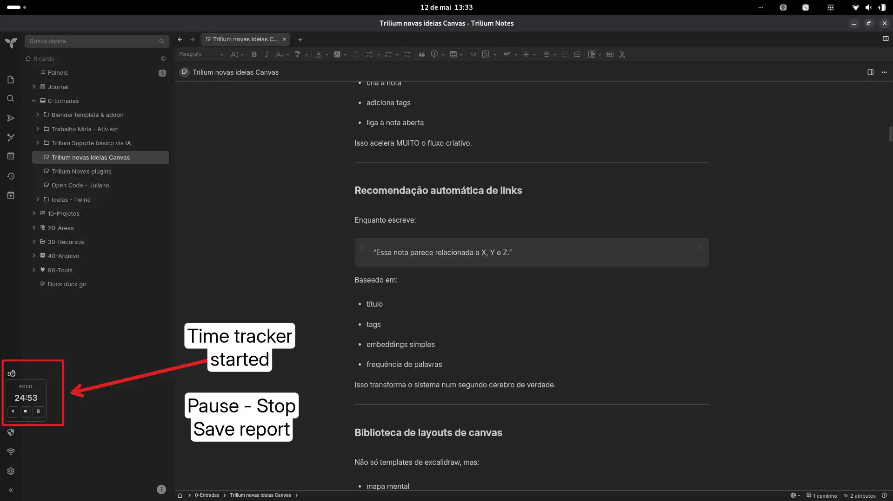
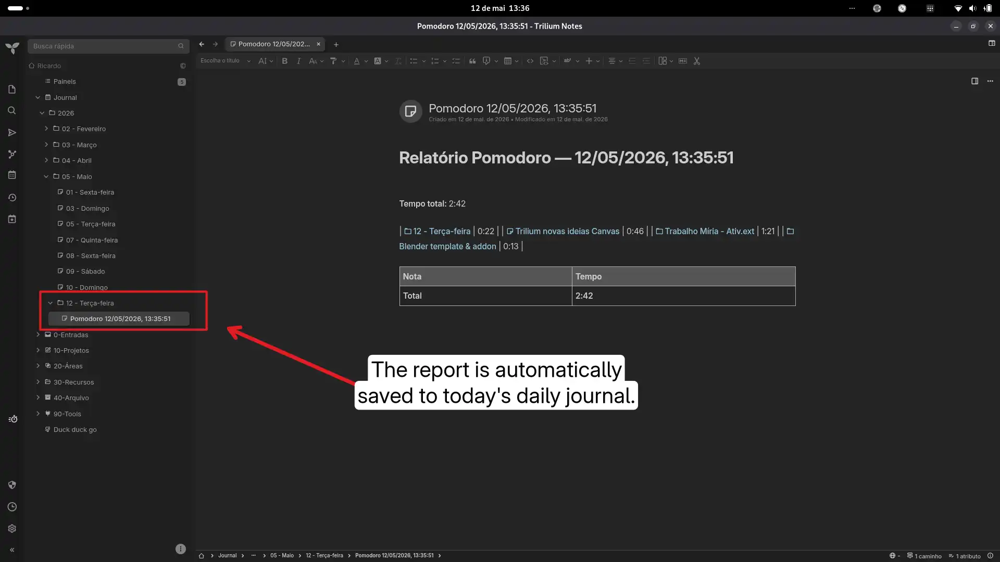
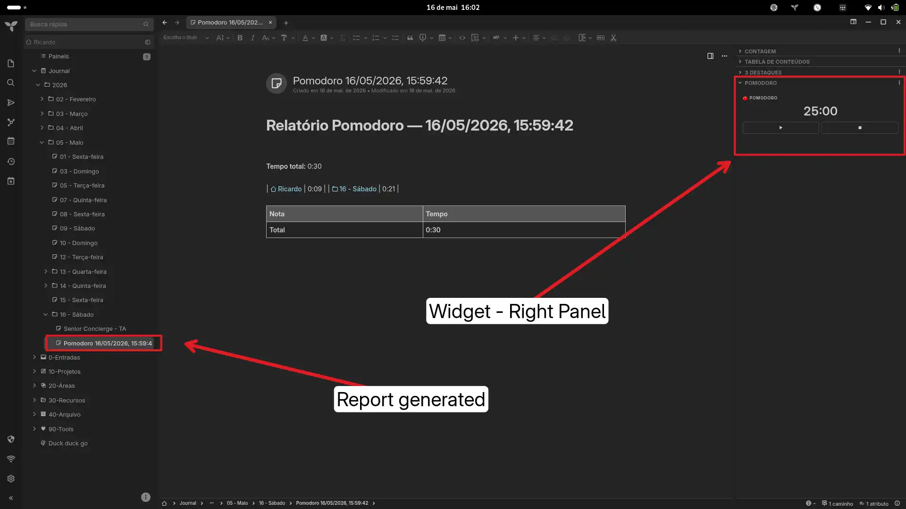

# Minimalist Pomodoro + Time Tracker

A monochromatic Pomodoro timer widget with per-note time tracking and report generation. Built with zero external dependencies.

## Features

* **Pomodoro Timer:** Standard 25min focus / 5min break cycles, chained automatically (focus → break → focus).
* **Wall-clock timer:** Time is computed from the session end timestamp, so minimizing the window or throttled timers never drift.
* **Per-Note Tracking:** Automatically logs how much time you spend on each note **while focusing** (breaks are not counted as note time).
* **Report on stop:** Creates a note (`#pomodoro`) as a child of the day note — or of the current note if there is no day note — with a table of notes × time, total, and completed cycles.
* **Pending report recovery:** Paused/closing mid-session keeps a pending report; a "Pending report" button appears until it is saved.
* **Safe stop:** The stop button asks for a second click when there is tracked time, and only clears the data after the report is successfully created.
* **Bilingual UI (PT/EN):** Follows Trilium's interface language (`locale`), including the report content and dates.
* **Monochromatic UI:** Uses the active theme's CSS variables (light/dark) for a distraction-free experience.
* **Keyboard:** With the focus inside the widget: `p` toggles start/pause, `s` saves the report.

## Usage

Right-pane widget (`#widget` label). Controls:

* ▶ / ⏸ — start / pause (pause preserves the remaining time and the tracked notes).
* ⏹ — stop: saves the report and resets the session (two clicks when there is data).
* 🗎 — save the report **without stopping** the timer (the tracking re-anchors to the current note).
* "Relatório pendente" — saves a pending report restored from localStorage.

Sessions chain automatically; the header shows the current cycle count and the status (Focus/Break).

## Installation

1. Create a `JS Frontend` note.
2. Paste the script code or import the `.zip`.
3. Add the label: `#widget`. Reload Trilium.

> To place the widget in the **left pane** instead, change `get parentWidget()` to `'left-pane'` (the comment at the top of the script has the details).

## Notes & limitations

* Durations are fixed at 25/5 minutes (configurable labels are on the roadmap).
* Tracking only runs while the timer is running and in a focus session.
* State lives in `localStorage` of the current installation (`pomo-*` keys); a corrupt pending payload is preserved and reported in the console.
* Reports are plain text notes; links to notes use the internal `#root/<noteId>` format.

## Tests

```bash
bun test-pomodoro.js   # pure functions: formatTime, cycles, report rows/escaping, restore
bun test-smoke.js      # Chrome headless: boot (PT/EN), start/stop 2-tap, pending report, corrupt state
```

## 🚀 What's New (Latest Updates)

**v5 - Audit round (2026-09)**

* **Stop no longer loses data:** the report is saved first; the session only resets on success (failure keeps the pending data).
* **Report fixed:** rows are real `<tr><td>` (they were markdown syntax inside `<tbody>`); note titles are HTML-escaped; the note gets the `#pomodoro` label and the date uses the session start (midnight crossing).
* **Offline tracking fix:** restored `lastTick` is re-anchored, so time with the app closed is never credited to a note.
* **Lifecycle cleanup:** a single `beforeunload` hook per page; boot restores the timer (running session resumes) and always repaints the UI.
* **Breaks excluded** from per-note time; `cycleCount` resets per report.
* **Accessibility:** `aria-label` on controls, `role="timer"`, live region for phase changes, ≥40px targets, `:focus-visible`, `prefers-reduced-motion`.
* **i18n PT/EN** and fixed hover/touch states.

**v4 - Native Widget Panel**

* **Right-pane widget:** Replaced the absolutely-positioned floating button with a proper `RightPanelWidget`, rendering the timer as a native collapsible section in the right panel.
* **No more overlap:** Removed `_autoposition()` and all manual coordinate logic — the widget now follows Trilium's layout system naturally.
* **Cleaner UI:** Timer display enlarged to 32px; controls expand to full width.

**v3 - Core Bug Fixes & Stability**

* **Wall-clock time tracking:** The timer no longer stops or loses time when the Trilium window is minimized or loses focus (bypassing `setInterval` throttling).
* **Pause fix:** Fixed a bug where time wasn't accounted for correctly after unpausing a session (`lastTick` reset issue).

**v2 - Workflow & Persistence**

* **Seamless Transitions:** Automatically chains sessions (Focus → Break → Focus) without stopping.
* **Safe Persistence:** Saves progress to `localStorage` on pauses or app closures; the restored pending report stays available until saved.
* **Auto-Reports:** Generates a formatted note on stop, detailing completed cycles (and if they were chained), total time, and time spent per note.

## Original link

[https://github.com/orgs/TriliumNext/discussions/9710](https://github.com/orgs/TriliumNext/discussions/9710)

### Images





#### v4 - Native Widget Panel

