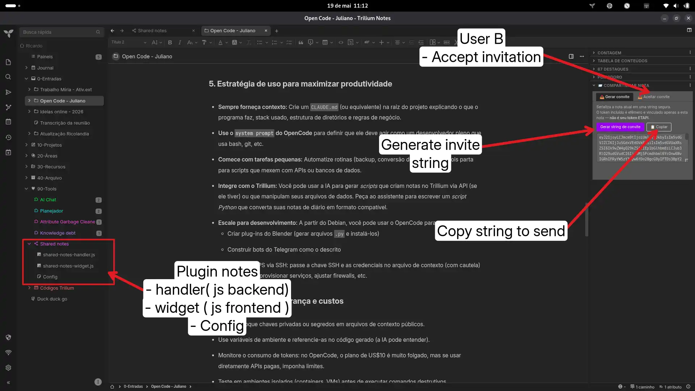

# Shared-notes - Secure P2P exchange between TriliumNext instances

## This is still an early experiment!!!

## 
Sharing and commenting system between Trilium instances.
No external server. No CORS. ETAPI token never exposed.

## Security Architecture

```text
Invite string contains:
  ✅ Note content (title + HTML)
  ✅ Public endpoint of A's handler
  ✅ Ephemeral UUID token (per invite, not the ETAPI)
  ❌ ETAPI token — never included

Sending replies:
  B → api.runOnBackend → require('https') → POST A's handler
  (server→server, no CORS, without exposing token)

Validation in A's handler:
  ✓ Token matches the gate note
  ✓ Single-use (409 if already used)
  ✓ 7-day expiration (410 if expired)
  ✓ Token bound to the original note (rejects tokens from other notes)

```

## Structure

```text
shared-notes-v2/
├── README.md
├── ESTADO.md        ← technical history for opencode
├── src/
│   ├── handler.js   ← backend handler (source)
│   └── widget.js    ← frontend widget (source)
└── import/
    ├── !!!meta.json
    ├── Shared Notes.html
    ├── shared-notes-handler.js
    └── shared-notes-widget.js

```

## Installation

1. Import the `import/` folder into Trilium:
Right-click on a folder → Import into note
2. Verify the `shared-notes-handler` note:
* Type: Code
* MIME: application/javascript;env=backend
* Label: #customRequestHandler = shared-notes-reply


3. Verify the `shared-notes-widget` note:
* Type: Code
* MIME: application/javascript;env=frontend
* Label: #widget


4. Create a configuration note (both users):
Add the label #sharedNotesConfig and:
* #myName     = Your Name
* #myEndpoint = [https://yourtrilium.com](https://www.google.com/search?q=https://yourtrilium.com)   (User A only)


5. Restart the Trilium container → F5

## Usage

### User A — sharing a note

1. Open the desired note
2. 📤 Generate invite tab → click "Generate string"
3. Copy and send the string (via email, Signal, or any channel)

### User B — accepting and replying

1. 📥 Accept invite tab → paste string → "Accept"
2. Note appears in 📥 Shared Inbox with full content
3. Create child notes as replies
4. ↩️ Send replies tab → "Send"

### User A — receiving

Replies arrive as child notes of the original note:
`↩️ B's Name — date | Reply title`

## Revoking an invite

Deleting the child gate note (🔒 Pending invite…) invalidates the token.
The handler will return a 404 error on any attempt to use it.

----

# Shared-notes - Troca P2P segura entre instâncias TriliumNext

( versão em Português do Brasil )

Sistema de compartilhamento e comentários entre instâncias Trilium.
Sem servidor externo. Sem CORS. Token ETAPI nunca exposto.

## Arquitetura de segurança

```
String de convite contém:
  ✅ Conteúdo da nota (título + HTML)
  ✅ Endpoint público do handler de A
  ✅ Token efêmero UUID (por convite, não é o ETAPI)
  ❌ Token ETAPI — nunca incluído

Envio de respostas:
  B → api.runOnBackend → require('https') → POST handler de A
  (servidor→servidor, sem CORS, sem expor token)

Validação no handler de A:
  ✓ Token bate com gate note
  ✓ Single-use (409 se já usado)
  ✓ Expiração 7 dias (410 se expirado)
  ✓ Token vinculado à nota original (não aceita token de outra nota)
```

## Estrutura

```
shared-notes-v2/
├── README.md
├── ESTADO.md          ← histórico técnico para opencode
├── src/
│   ├── handler.js     ← backend handler (fonte)
│   └── widget.js      ← frontend widget (fonte)
└── import/
    ├── !!!meta.json
    ├── Shared Notes.html
    ├── shared-notes-handler.js
    └── shared-notes-widget.js
```

## Instalação

1. Importar pasta `import/` no Trilium:
   Botão direito numa pasta → Import into note

2. Verificar nota `shared-notes-handler`:
   - Tipo: Code
   - MIME: application/javascript;env=backend
   - Label: #customRequestHandler = shared-notes-reply

3. Verificar nota `shared-notes-widget`:
   - Tipo: Code
   - MIME: application/javascript;env=frontend
   - Label: #widget

4. Criar nota de configuração (ambos os usuários):
   Adicionar label #sharedNotesConfig e:
   - #myName     = Seu Nome
   - #myEndpoint = https://seutrilium.com   (só User A)

5. Reiniciar o container Trilium → F5

## Uso

### User A — compartilhar nota
1. Abrir a nota desejada
2. Aba 📤 Gerar convite → clicar em "Gerar string"
3. Copiar e enviar a string (email, Signal, qualquer canal)

### User B — aceitar e responder
1. Aba 📥 Aceitar convite → colar string → "Aceitar"
2. Nota aparece em 📥 Shared Inbox com conteúdo completo
3. Criar notas filhas como respostas
4. Aba ↩️ Enviar respostas → "Enviar"

### User A — receber
As respostas chegam como notas filhas da nota original:
`↩️ Nome de B — data | Título da resposta`

## Revogar convite
Deletar a gate note filha (🔒 Convite pendente…) invalida o token.
O handler retornará 404 em qualquer tentativa de uso.


### Images  



