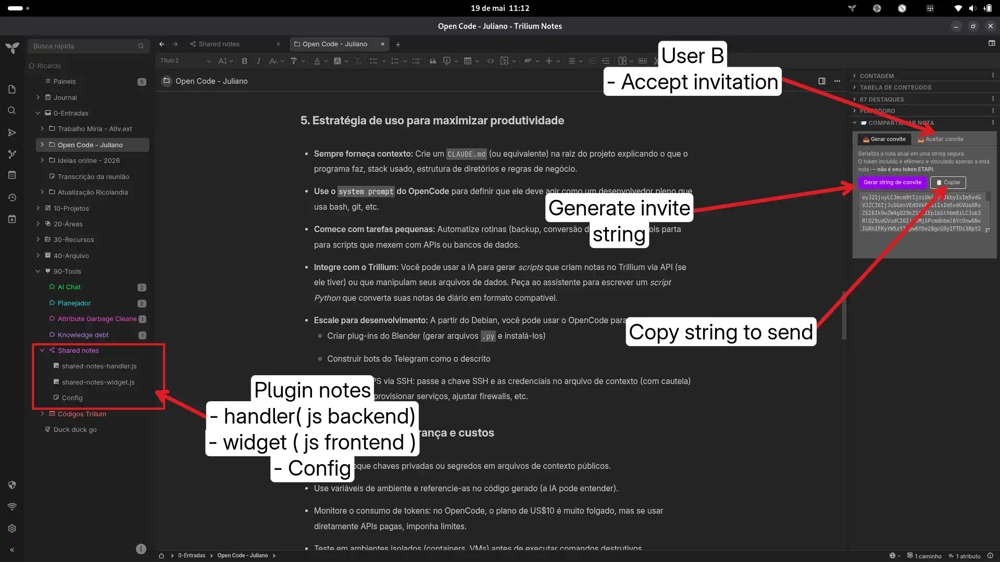

# Shared-notes — Secure P2P exchange between TriliumNext instances

Bidirectional sharing and commenting system between Trilium instances.
No external server. No CORS. ETAPI token never exposed.

## Features

- **Secure invite** — ephemeral UUID token per invite; ETAPI token never shared
- **Bidirectional replies** — A and B can reply to each other, multiple rounds (the return channel is created on accept)
- **Cumulative sending** — only new child notes are transmitted each round; gates and received replies are ignored
- **Versioned snapshots** — A can send updated versions of a note; B's copy updates in-place and the reply token is renewed
- **Multi-use invite + instant revoke** — the invite works for the whole conversation; delete the gate note to revoke
- **7-day invite expiration** — checked by the handler on every use
- **Bilingual UI (PT/EN)** — follows the Trilium interface language (`locale` option), like Canvas Tools

## Security Architecture

```text
Invite string contains:
  ✅ Note content (title + HTML)
  ✅ Public endpoint of the sender's handler
  ✅ Ephemeral UUID token (per invite, not the ETAPI token)
  ✅ Snapshot version number
  ❌ ETAPI token — never included

Sending replies:
  B → api.runOnBackend → fetch → POST A's handler
  A → api.runOnBackend → fetch → POST B's handler
  (server→server, no CORS, without exposing token)

Validation in the receiving handler:
  ✓ Token matches a gate note
  ✓ 7-day expiration for invites (410 if expired)
  ✓ Token bound to the anchor note (rejects tokens from other notes)
  ✓ replyEndpoint must be https, or http only on localhost/private networks
    or Tailscale (100.64.0.0/10); 169.254.0.0/16 is blocked

Tracking:
  ✓ snSent label on each child note (cumulative sending)
  ✓ snVersion label on shared notes (versioned snapshots)
  ✓ inviteToken / replyToken: peer token used to reach the other side
  ✓ myReplyToken: own return channel token, sent to the peer
```

## Installation

1. Import the `Shared-notes.zip` into Trilium: right-click a folder → Import into note (Trilium reads the export format inside the zip). Alternatively, create the notes manually and paste the contents of `shared-notes-widget.js` and `shared-notes-handler.js`.

2. Verify the `shared-notes-handler` note:
   - Type: Code
   - MIME: `application/javascript;env=backend`
   - Label: `#customRequestHandler = shared-notes-reply`

3. Verify the `shared-notes-widget` note:
   - Type: Code
   - MIME: `application/javascript;env=frontend`
   - Label: `#widget`

4. Create a configuration note (both users):
   Add the label `#sharedNotesConfig` with:
   - `#myName = Your Name` (required for both)
   - `#myEndpoint = https://yourtrilium.com` (required to **send and receive** replies)
   - `http://` endpoints are accepted only for localhost, private networks or Tailscale (LAN/tailnet tests)

5. Restart Trilium → F5

> Migration note: if you installed AI Chat before Sep/2026, remove the `#sharedNotesConfig` label from its "AI Chat Config" note (an old manifest used that label by mistake).

## Usage

### User A — sharing a note

1. Open the desired note
2. Tab 📤 **Gerar convite** → click "Gerar string"
3. Copy and send the string (email, Signal, any channel)
4. Each new invite increments the snapshot version (`snVersion` label)

### User B — accepting a snapshot

1. Tab 📥 **Aceitar convite** → paste string → "Aceitar"
2. The note appears in 📥 **Shared Inbox** with the full content
3. A return channel is created automatically (gate note `🔒 Canal de retorno`) so A can reply back
4. If a note with the same `sharedNoteId` already exists, its content is **updated in-place** (child notes preserved, invite token renewed)

### Sending replies (both users)

1. Open the shared/received note (must have a `replyEndpoint` label)
2. Create child notes as your replies
3. Tab ↩️ **Responder** → "Enviar respostas"
4. Only **unsent** child notes are transmitted (`snSent` label); gate notes and received replies are skipped
5. Subsequent rounds send only new child notes

### User A — receiving and replying back

1. After B sends replies, the original note gains `replyEndpoint` + `replyToken` labels (B's channel)
2. Tab ↩️ **Responder** appears on the original note
3. Create child notes and send — this works for multiple rounds (both sides must be on the current version)

### Versioned snapshots (A → B updates)

1. A edits the note and generates a **new invite** (snapshot version increments)
2. B pastes the new string in 📥 **Aceitar convite**
3. The handler finds the existing note by `sharedNoteId` (anywhere in the tree) and **updates its content**
4. Child notes (previous replies) are **preserved** and the invite token is renewed
5. Note title shows the new version: `📨 A — Title [v2]`

## Revoking an invite

Delete the gate notes (`🔒 Convite pendente…` / `🔒 Canal de retorno…`). The handler will return 404 on any attempt to use them. Deleting the received note also breaks its return channel.

---

# Shared-notes — Troca P2P segura entre instâncias TriliumNext

Sistema bidirecional de compartilhamento e comentários entre instâncias Trilium.
Sem servidor externo. Sem CORS. Token ETAPI nunca exposto.

## Funcionalidades

- **Convite seguro** — token UUID efêmero por convite; ETAPI nunca compartilhado
- **Respostas bidirecionais** — A e B podem responder múltiplas rodadas (o canal de retorno é criado no aceite)
- **Envio cumulativo** — apenas notas filhas novas são transmitidas a cada rodada; gates e respostas recebidas ficam de fora
- **Snapshots versionados** — A pode enviar versões atualizadas; B recebe in-place e o token de envio é renovado
- **Convite multiuso + revogação imediata** — o convite vale para a conversa toda; deletar a gate note revoga
- **Expiração de 7 dias** — verificada pelo handler a cada uso
- **UI bilíngue (PT/EN)** — segue o idioma da interface do Trilium (opção `locale`), como o Canvas Tools

## Arquitetura de segurança

```
String de convite contém:
  ✅ Conteúdo da nota (título + HTML)
  ✅ Endpoint público do handler de quem envia
  ✅ Token efêmero UUID (por convite, não é o ETAPI)
  ✅ Número da versão do snapshot
  ❌ Token ETAPI — nunca incluído

Envio de respostas:
  B → api.runOnBackend → fetch → POST handler de A
  A → api.runOnBackend → fetch → POST handler de B
  (servidor→servidor, sem CORS, sem expor token)

Validação no handler de quem recebe:
  ✓ Token bate com uma gate note
  ✓ Expiração de 7 dias do convite (410 se expirado)
  ✓ Token vinculado à nota âncora (rejeita tokens de outras notas)
  ✓ replyEndpoint exige https; http apenas localhost/rede privada
    ou Tailscale (100.64.0.0/10); 169.254.0.0/16 bloqueado

Rastreamento:
  ✓ Label snSent em cada child note (envio cumulativo)
  ✓ Label snVersion nas notas (snapshots versionados)
  ✓ inviteToken / replyToken: token do peer para alcançar o outro lado
  ✓ myReplyToken: token do próprio canal de retorno, enviado ao peer
```

## Instalação

1. Importar o `Shared-notes.zip` no Trilium: botão direito numa pasta → Import into note (o Trilium lê o formato de export dentro do zip). Alternativa: criar as notas manualmente e colar o conteúdo de `shared-notes-widget.js` e `shared-notes-handler.js`.

2. Verificar nota `shared-notes-handler`:
   - Tipo: Code
   - MIME: `application/javascript;env=backend`
   - Label: `#customRequestHandler = shared-notes-reply`

3. Verificar nota `shared-notes-widget`:
   - Tipo: Code
   - MIME: `application/javascript;env=frontend`
   - Label: `#widget`

4. Criar nota de configuração (ambos os usuários):
   Label `#sharedNotesConfig` com:
   - `#myName = Seu Nome` (obrigatório para ambos)
   - `#myEndpoint = https://seutrilium.com` (obrigatório para **enviar e receber** respostas)
   - Endpoints `http://` só são aceitos para localhost, rede privada ou Tailscale (testes na LAN/tailnet)

5. Reiniciar o Trilium → F5

> Migração: se você instalou o AI Chat antes de set/2026, remova o label `#sharedNotesConfig` da nota "AI Chat Config" dele (um manifest antigo usava esse label por engano).

## Uso

### User A — compartilhar nota

1. Abrir a nota desejada
2. Aba 📤 **Gerar convite** → clicar "Gerar string"
3. Copiar e enviar a string (email, Signal, qualquer canal)
4. Cada novo convite incrementa a versão do snapshot (label `snVersion`)

### User B — aceitar snapshot

1. Aba 📥 **Aceitar convite** → colar string → "Aceitar"
2. A nota aparece em 📥 **Shared Inbox** com o conteúdo completo
3. Um canal de retorno é criado automaticamente (gate note `🔒 Canal de retorno`) para A poder responder de volta
4. Se já existe nota com o mesmo `sharedNoteId`, o conteúdo é **atualizado in-place** (notas filhas preservadas, token de convite renovado)

### Enviar respostas (ambos os usuários)

1. Abrir a nota compartilhada/recebida (precisa ter label `replyEndpoint`)
2. Criar notas filhas como suas respostas
3. Aba ↩️ **Responder** → "Enviar respostas"
4. Apenas notas filhas **não enviadas** são transmitidas (label `snSent`); gates e respostas recebidas são ignoradas
5. Rodadas subsequentes enviam apenas notas filhas novas

### User A — receber e responder de volta

1. Após B enviar respostas, a nota original ganha os labels `replyEndpoint` + `replyToken` (canal de B)
2. Aba ↩️ **Responder** aparece na nota original
3. Criar notas filhas e enviar — funciona em **múltiplas rodadas** (os dois lados precisam estar na versão atual)

### Snapshots versionados (A → B atualizações)

1. A edita a nota e gera um **novo convite** (versão do snapshot incrementa)
2. B cola a nova string em 📥 **Aceitar convite**
3. O handler encontra a nota existente pelo `sharedNoteId` (em qualquer pasta da árvore) e **atualiza o conteúdo**
4. Notas filhas (respostas anteriores) são **preservadas** e o token de convite é renovado
5. Título da nota mostra a nova versão: `📨 A — Título [v2]`

## Revogar convite

Deletar as gate notes (`🔒 Convite pendente…` / `🔒 Canal de retorno…`). O handler retornará 404 em qualquer tentativa de uso. Deletar a nota recebida também derruba o canal de retorno dela.

### Images


