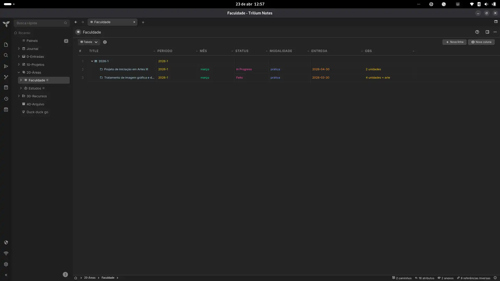
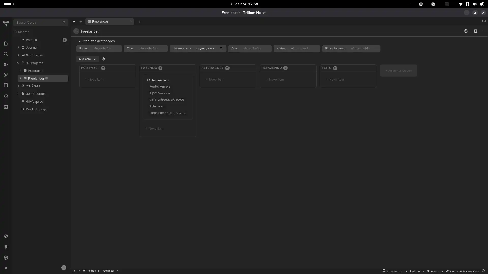
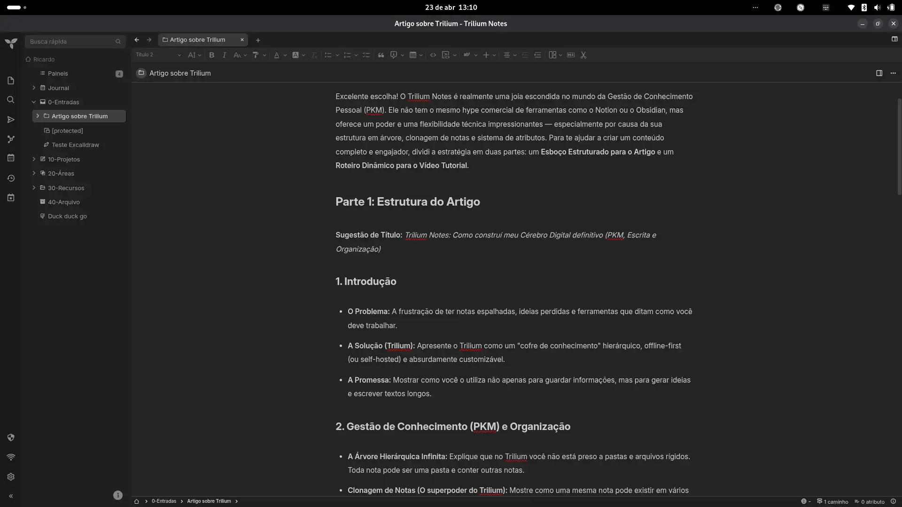
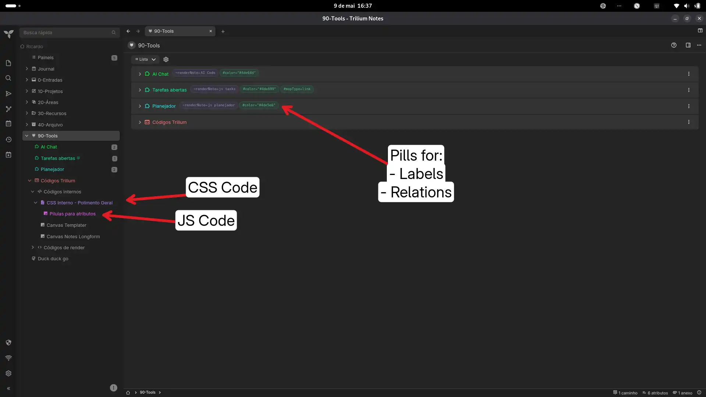
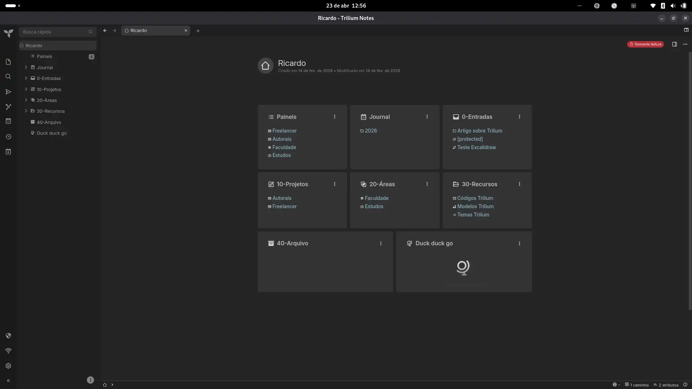

# CSS Tweaks – Polished UI for Trilium

A set of CSS styles to improve readability and elegance of the TriliumNext interface.

## Installation
1. Import `CSS_Tweaks_UI_Polished.zip` as an appearance note (or create a **Code – CSS** note with the code and apply it via settings).
2. Adjust the styles to your preference.
3. Add the label `#appCss` to the note's attributes.

## Original link
[https://github.com/orgs/TriliumNext/discussions/9553](https://github.com/orgs/TriliumNext/discussions/9553)


---


## 🌟 Key Features

### 1. General Polish & Scrollbars

* **Minimalist Scrollbars:** Slimmer scrollbars (6px) with a transparent track and a subtle thumb that perfectly matches your current theme's border color.
* **Theme-Aware Selection:** Highlighting text now uses a beautifully tinted color mixed from the main text color.
* **Fixed Card Links:** Corrects opacity issues on card links, ensuring titles remain bold and legible while adding a smooth hover underline effect.

### 2. Sidebar & Note Tree (Launcher & Fancytree)

* **Centered Launcher Icons:** Fixes padding conflicts to ensure left-sidebar icons are perfectly sized (14px) and centered.
* **Refined Note Tree:** Increases padding and border-radius for tree items, making them more clickable and modern.
* **Active Note Highlighting:** The currently active note receives a prominent blue background badge on its title and a solid left border on the node, making it impossible to lose your place.
* **Sleek Hover Effects:** Smooth background transitions when hovering over notes in the tree.

### 3. Obsidian-Style Text Editor

* **Spacious Typography:** Increases line height (1.9) and margin spacing for paragraphs and lists to improve readability.
* **Prominent Headers:** H1, H2, and H3 tags are bolder and feature increased top and bottom margins for distinct visual hierarchy.
* **Auto-Hiding Toolbar:** The CKEditor top toolbar now fades out (50% opacity) when you are just reading, and fully appears (100% opacity) when you focus on the editor or hover over it.

### 4. Card View Enhancements

* **Responsive Grid:** Introduces dynamic auto-fill columns with proper gaps (12px) to prevent cards from touching each other on desktop.
* **Flat Design:** Removes default box-shadows in favor of clean, subtle 1px borders with rounded corners (8px).
* **Better Padding:** Increases inner padding for more "breathing room" around the text.

### 5. Elegant Kanban Board View (V3)

* **Translucent Columns:** Columns use a color-mixed semi-transparent background.
* **Color-Coded Headers:** The first 5 columns automatically receive distinct, beautifully colored top borders (Blue, Orange, Teal, Red, Purple).
* **Interactive Cards:** Board notes feature a subtle hover lift (`translateY`) and border color transition.
* **Refined Add Buttons:** "New Item" and "Add Column" buttons have dashed borders and soft background colors on hover.

### 6. Colorful Table View (Collection View)

* **Auto-Coloring Columns:** The first 15 columns are automatically color-coded with distinct, harmonious hex values for extreme data clarity.
* **Clean Borders:** Uses semi-transparent borders for cells and headers to avoid a cluttered look.
* **Row Hover Effects:** Entire rows softly highlight when hovered.
* **Refined Resize Handles:** Column resize handles only appear on hover to keep headers looking clean.


### 7. Mobile Optimization

* **Single-Column Cards:** Forces card views into a single column on mobile screens to prevent text from being squished or cut off.
* **Hidden Code Blocks in Cards:** Hides `<pre>` and `<code>` blocks within card previews on mobile, as long lines of code (like shebangs) often break the card layout.
* **Always-Visible Editor Toolbar:** Bypasses the auto-hiding editor toolbar on mobile, as touch devices don't have a "hover" state.
* **Horizontal Scroll for Tables:** Markdown tables now automatically scroll horizontally on small screens to prevent the entire page from breaking its width.
* **Scaled Typography:** Dynamically reduces font sizes for titles, headers, and UI elements to fit perfectly on smaller viewports.


### 8. Promoted Attributes & Tags

* **Attribute Table Layout:** Transforms standard promoted attributes into a clean, aligned table layout (`Label:` `Value`).
* **Rounded Pills:** Note attributes in the list view are transformed into beautiful rounded pills with a monospace font.
* **Labels (`#`):** Rendered with a soft green background and border.
* **Relations (`~`):** Rendered with a soft blue background and border.

**Context:** When a note uses the `collection` type with **List view**, attributes shown on the right side of each item are rendered as a single raw text string inside `.rendered-note-attributes` — something like:

```
~renderNote=AI Code #color="#4de64d" #subtreeHidden
```

There's no per-attribute markup, so CSS alone can't target individual labels or relations. This snippet uses a small frontend script to re-parse and re-render those strings as styled pills, then CSS to style them.

---

## How it works

The `.rendered-note-attributes` span contains a mix of raw text nodes and `<a>` anchor elements (for relation targets). The script walks those child nodes, identifies labels (`#`) and relations (`~`) by their prefix, and rebuilds the element as a sequence of individual `<span class="attr-pill ...">` elements. A `MutationObserver` watches for new list items so it works dynamically as you navigate.

A configurable `HIDDEN` set lets you suppress noisy system attributes (like `#color`, `#subtreeHidden`, `#iconClass`) that are already expressed visually elsewhere in the UI.

---


## Setup

### 1. Frontend Script

Create a new note of type **JS Frontend** and add the attribute `#run=frontendStartup`.

Paste the following code:

```javascript
const HIDDEN = new Set(['subtreeHidden', 'color', 'iconClass', 'viewType']);

function parsePills(el) {
  if (el.dataset.pillified === '1') return;
  el.dataset.pillified = '1';

  const pills = [];
  let pending = null;

  for (const node of el.childNodes) {
    if (node.nodeType === Node.TEXT_NODE) {
      for (const part of node.textContent.split(/\s+/).filter(Boolean)) {
        if (pending) { pills.push(pending); pending = null; }

        if (part.endsWith('=')) {
          pending = { type: 'relation', prefix: part, link: null };
        } else {
          pills.push({
            type: part.startsWith('~') ? 'relation' : 'label',
            prefix: part,
            link: null
          });
        }
      }
    } else if (node.tagName === 'A') {
      if (pending) {
        pending.link = node.cloneNode(true);
        pills.push(pending);
        pending = null;
      } else {
        pills.push({ type: 'relation', prefix: '~', link: node.cloneNode(true) });
      }
    }
  }
  if (pending) pills.push(pending);

  el.innerHTML = '';

  for (const pill of pills) {
    const name = (pill.prefix || '').replace(/^[~#]/, '').replace(/=$/, '');
    if (HIDDEN.has(name)) continue;

    const span = document.createElement('span');
    span.className = `attr-pill attr-pill-${pill.type}`;

    if (pill.link) {
      span.appendChild(document.createTextNode(pill.prefix));
      span.appendChild(pill.link);
    } else {
      span.textContent = pill.prefix;
    }
    el.appendChild(span);
  }
}

function processAll() {
  document.querySelectorAll('.rendered-note-attributes:not([data-pillified])').forEach(parsePills);
}

processAll();

new MutationObserver(mutations => {
  for (const m of mutations) {
    m.addedNodes.forEach(node => {
      if (node.nodeType !== Node.ELEMENT_NODE) return;
      if (node.matches?.('.rendered-note-attributes')) parsePills(node);
      node.querySelectorAll?.('.rendered-note-attributes:not([data-pillified])').forEach(parsePills);
    });
  }
}).observe(document.body, { childList: true, subtree: true });
```

## Customization

- **Pill size:** adjust `font-size` in `.attr-pill` (e.g. `0.8em`) and `padding` as needed.
- **Hidden attributes:** edit the `HIDDEN` set in the script to add or remove attribute names you want suppressed.
- **Colors:** the green/teal tones are for labels, blue/purple for relations — change `rgba()` values freely to match your theme.

---

## Notes

- Tested on TriliumNext with List view on `collection`-type notes.
- The `MutationObserver` handles dynamic navigation without needing to reload.
- This does not affect other note views (Book, Grid, etc.) — only `.rendered-note-attributes` elements are targeted.
---

### Screenshots






