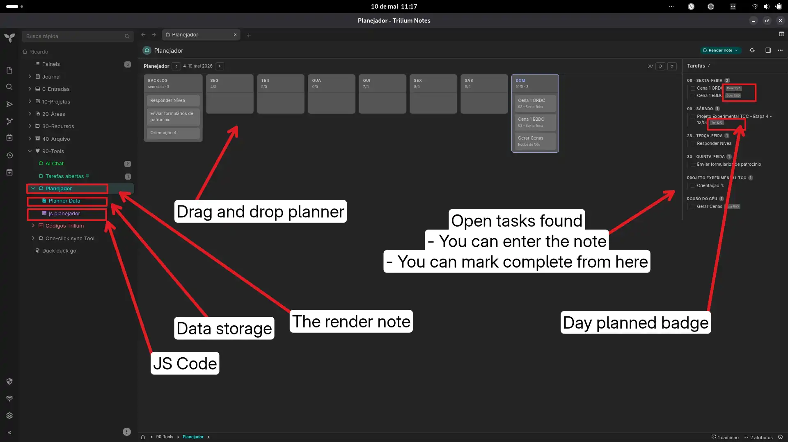
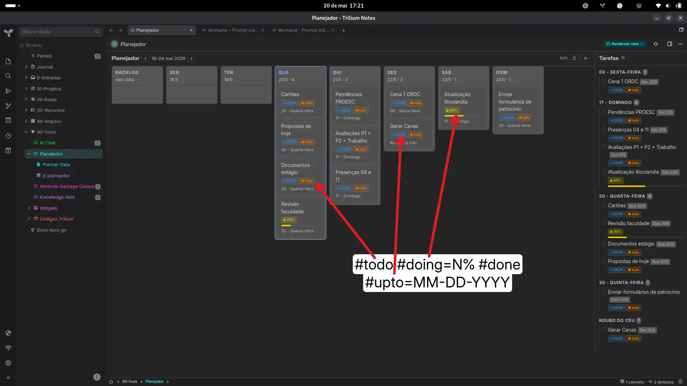
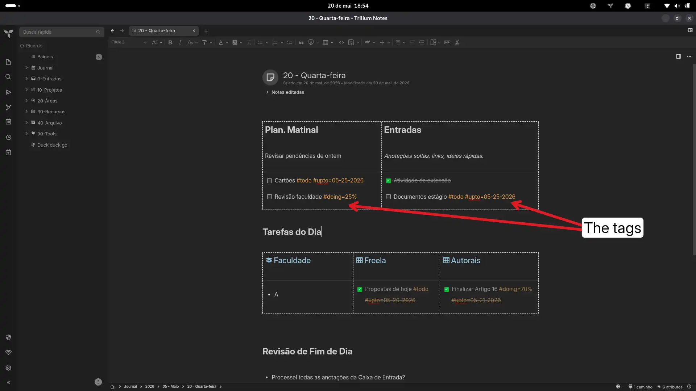
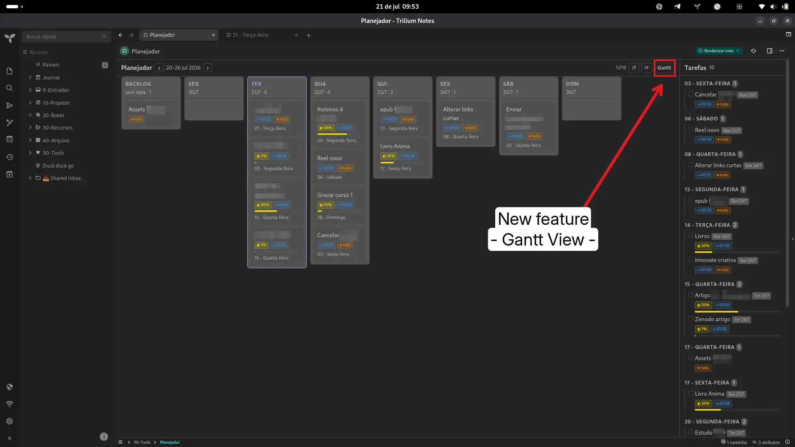
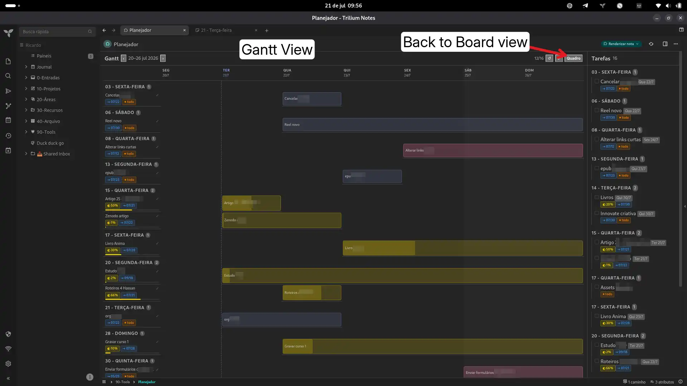
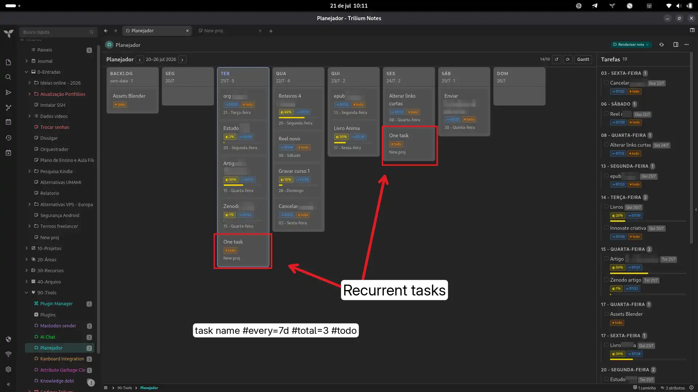
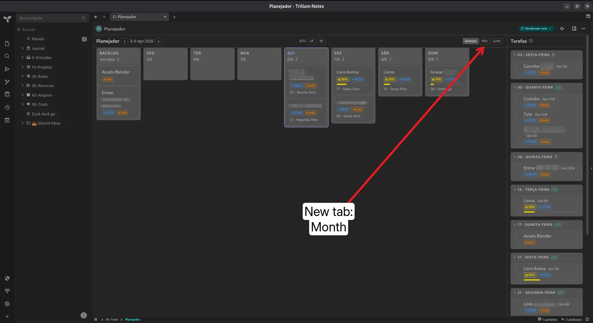
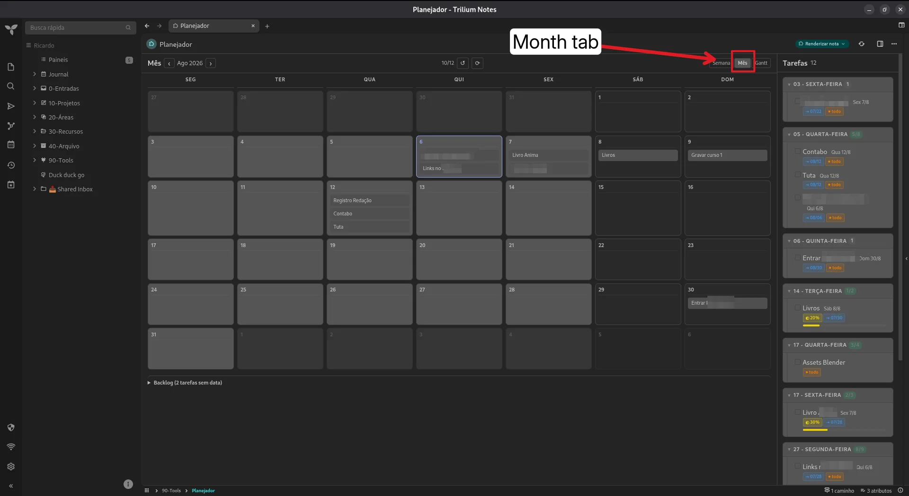
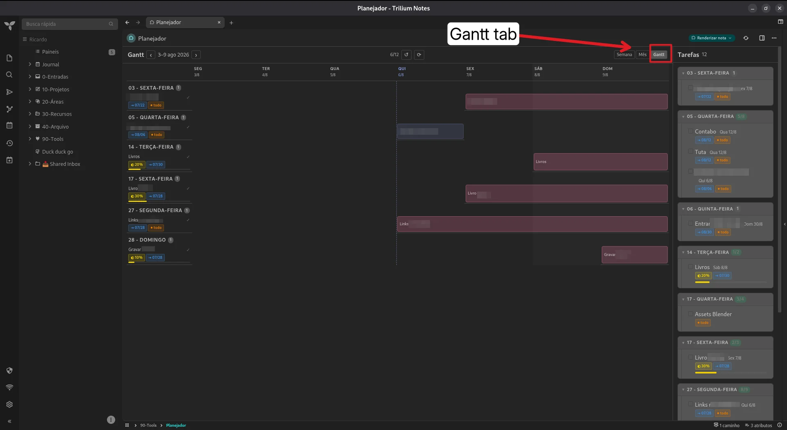

# Weekly Planner & Open Tasks Panel

A unified workspace for TriliumNext featuring a drag-and-drop weekly planner and a global open tasks panel.

## Features

* **Shared Architecture:** A unified system that feeds both the planner and the tasks list. Any action in one panel re-renders the other.
* **Drag and Drop:** Dragging in the planner automatically updates the day badges in the tasks panel.
* **Global Synchronization:** The Open Tasks panel scans every note across the entire database to locate all pending tasks.
* **Contextual Badges:** Tasks allocated in the planner display a discreet badge (e.g., Wed 14/5) in the tasks panel.
* **Mark as Done:** Check off individual tasks directly from the panel, or click to enter the source note. Marking as done removes the task from the backlog.
* **Gantt View:** Toggle between Kanban board and Gantt chart. Bars span from the planned day to `#upto` deadline, color-coded by status.
* **Month View:** Calendar-style monthly view (5-6 weeks × 7 days) with drag & drop between day cells, dimmed out-of-month days, and collapsible backlog.
* **Recurring Tasks:** Create tasks that repeat automatically with `#every=Nd` + `#total=N`. Clones are generated in the note and auto-placed on their due dates.
* **Mode Switcher:** Segmented control in every header — `[Semana] [Mês] [Gantt]` — with persisted preference across reloads.
* **Task List Enhancements:** Note groups are cards with done/total badges and collapsible tasks (click ▾/▸).


## Installation

1. Download the `Task_Planner.zip` and `Open_tasks_list.zip` (if kept separate, or the unified zip) and import it into Trilium.
2. **Data Storage:** Create a note named "Planner Data" of type `Code - JSON`, and assign the labels `#plannerdata` and `#data`.
3. **Render:** Create a Render note to show the planner. On the Render note, add the relation: `~renderNote` pointing to the JS Frontend note.

## Changelog

### Features

- **Mobile layout**: painéis empilhados em coluna única (planner acima, tarefas abaixo) em telas < 700px — sem espremer as duas colunas no celular
- **Mobile Mês — backlog agendável**: no celular, tocar num item do backlog da visão Mês abre o seletor de dias (mesmo comportamento do Kanban); antes só abria a nota
- **Mobile Gantt**: no celular o Gantt vira uma lista vertical por dia (em vez do grid largo com scroll horizontal); tocar no item abre a nota e ✓ conclui
- **Tag parsing**: `#todo`, `#doing=N%`, `#done`, `#upto=MM-DD-YYYY` in task text are extracted and displayed as colored badges
- **Planner badges**: tags show up on draggable kanban cards in the weekly board
- **Task list badges**: tags show up in the right sidebar task list
- **Progress bars**: tasks with `#doing=N%` get a thin proportional fill bar
- **Cross-theme**: colors use `rgba()` with opacity — works on both light and dark themes

### Visual tweaks

- **Bigger cards**: padding 7×10 → 10×12 px, line-height 1.4 → 1.5
- **Larger fonts**: task text 16→17px, badges 10→11px, headers 18→19px
- **More spacing**: card gap 6→8px, increased internal margins
- **Darker card background**: overlay on `--accented-background-color` for better contrast on both themes
- **Fix mobile — largura do painel de tarefas**: `max-width:320px` inline do `.wp-tk` sobrepunha o media query (que não tinha `!important`) — o painel "Tarefas" ficava numa tira estreita de 320px embaixo do planner no celular. Corrigido com `width/max-width/min-width !important` nos dois painéis.
- **Monochrome icon**: `⇢` instead of `⏰` for terminal-friendly display

### Tag color palette

| Tag      | Color   | Display |
|----------|---------|---------|
| `#todo`  | Orange  | ● todo  |
| `#doing=N%` | Yellow | ◐ N% + bar |
| `#done`  | Green   | ● done  |
| `#upto`  | Blue    | ⇢ DD/MM |
| `#every=Nd` | Magenta | ↻ Nd (recurring) |
| `#total=N` | — | Total occurrences |

### Recurring Tasks

Tags: `#every=Nd` + `#total=N` + `#upto=MM-DD-YYYY`

```text
Revisar senhas #every=7d #total=4 #upto=07-21-2026
```

- Generates **N-1 clones** of the `<li>` element, each with `#upto` spaced N days apart
- Clones are inserted into the note's HTML and auto-assigned to their due dates
- Mark any clone as done independently; the original keeps the `#every` tag as source
- Edit the note to see all occurrences side by side
- Changing `#every` or `#total` after expansion requires manual cleanup

### Code

- `parseTaskTags(text)` → `{ cleanText, tags[] }` — parses `#todo`, `#doing`, `#done`, `#upto`, `#every`, `#total`
- `renderTagBadges(tags)`, `renderDoingBar(tags)` helpers
- `renderGantt()` — Gantt chart view with day columns, progress bars, and weekend/today highlights
- `renderMonth()` — calendar month view (grid of weeks × days) with task chips and drag & drop
- `getMonthDays(offset)` — builds the month grid aligned to Monday, marking out-of-month days
- `expandRecurringInContent(content)` — clones `<li>` elements with `#every+Nd` + `#total+N`
- Shared CSS constants (`TAG_CSS`, `BTN_CSS`, `MODE_CSS`) keep all three views visually identical
- Cross-theme CSS with CSS variables + fallbacks + overlay

## Original link
[https://github.com/orgs/TriliumNext/discussions/9676](https://github.com/orgs/TriliumNext/discussions/9676)

### Images  












