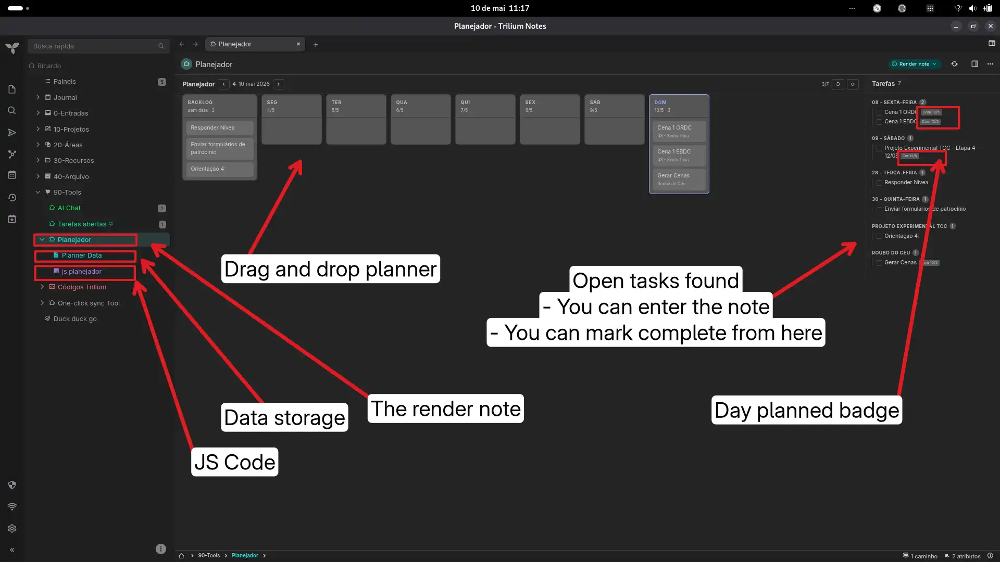
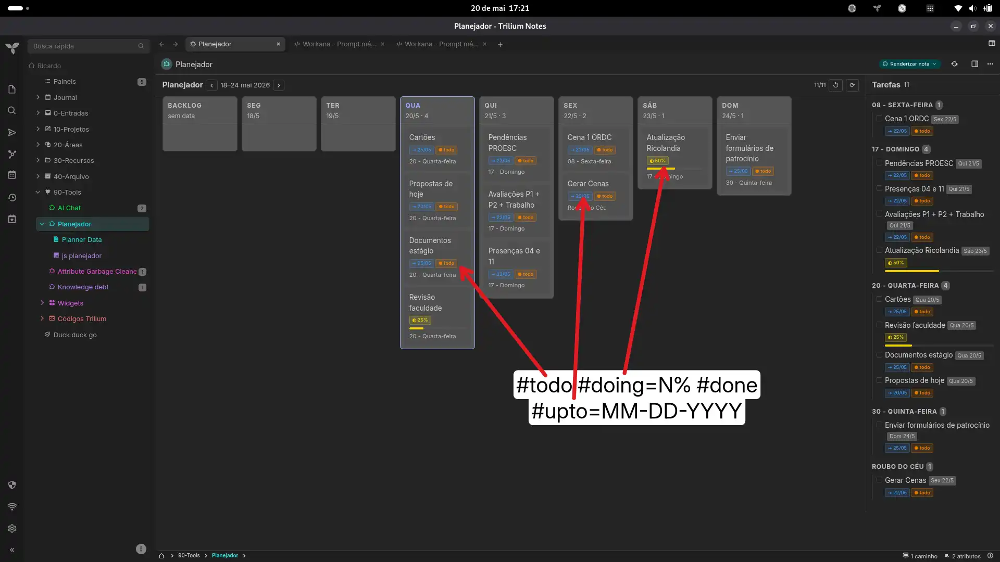
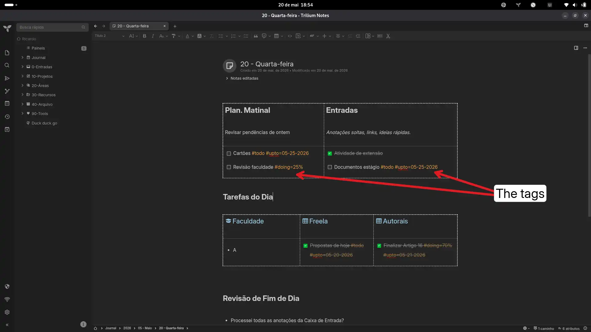
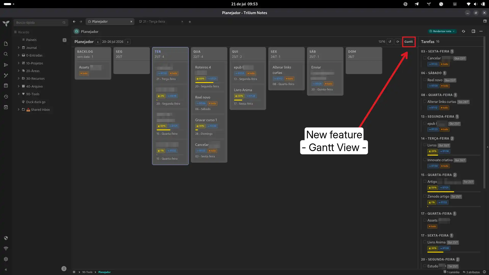
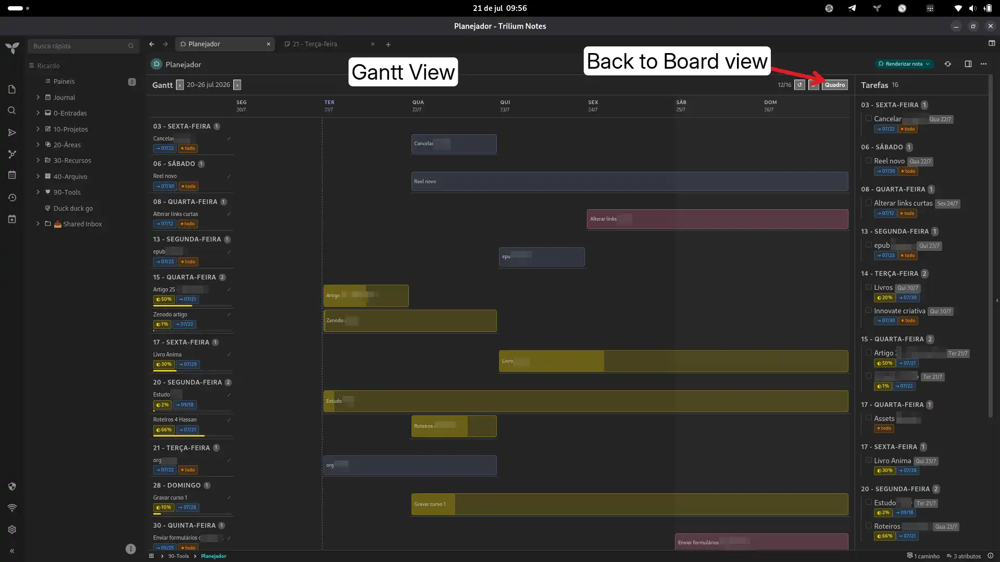
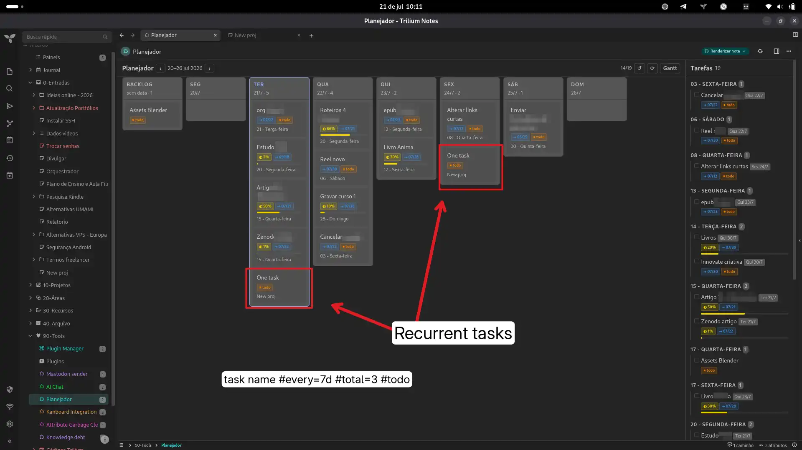
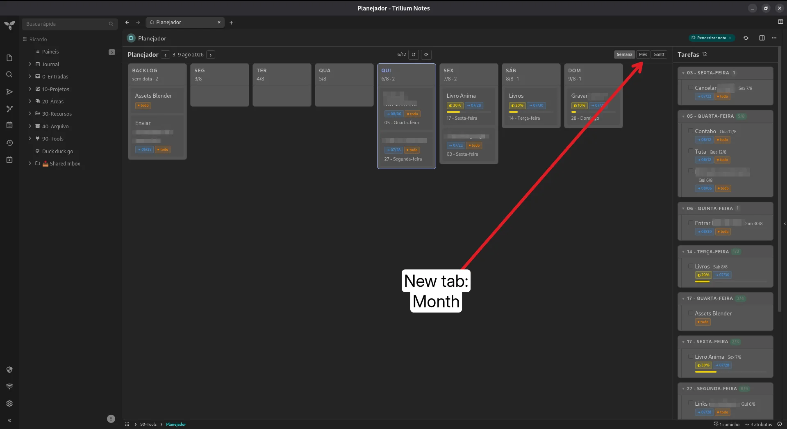
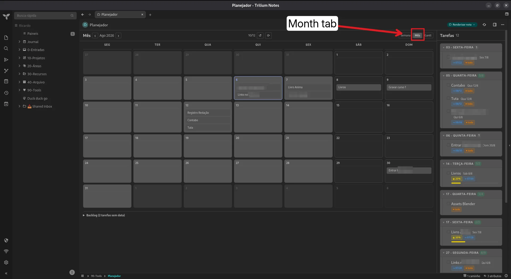
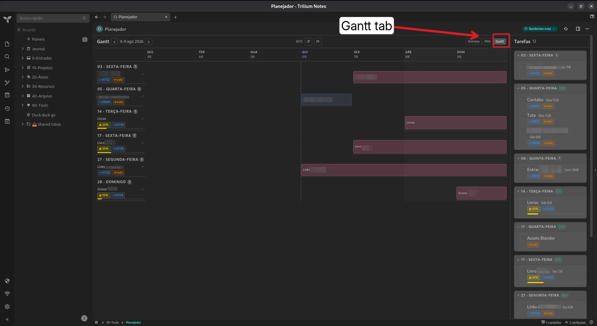

# Weekly Planner & Open Tasks Panel

A unified workspace for TriliumNext featuring a drag-and-drop weekly planner and a global open tasks panel.

## Features

* **Shared Architecture:** A unified system that feeds both the planner and the tasks list. Any action in one panel re-renders the other.
* **Drag and Drop:** Dragging in the planner automatically updates the day badges in the tasks panel.
* **Global Synchronization:** The Open Tasks panel scans every note across the entire database to locate all pending tasks.
* **Contextual Badges:** Tasks allocated in the planner display a discreet badge (e.g., Wed 14/5) in the tasks panel.
* **Mark as Done:** Check off individual tasks directly from the panel, or click to enter the source note. Marking as done removes the task from the backlog.
* **Gantt View:** Toggle between Kanban board and Gantt chart. Bars span from the planned day to `#upto` deadline, color-coded by status.
* **Month View:** Calendar-style monthly view (5-6 weeks × 7 days) with drag & drop between day cells, dimmed out-of-month days, and collapsible backlog.
* **Recurring Tasks:** Create tasks that repeat automatically with `#every=Nd` + `#total=N`. Clones are generated in the note and auto-placed on their due dates.
* **Mode Switcher:** Segmented control in every header — `[Semana] [Mês] [Gantt]` — with persisted preference across reloads.
* **Task List Enhancements:** Note groups are cards with done/total badges and collapsible tasks (click ▾/▸).


## Installation

1. Download the `Task_Planner.zip` and `Open_tasks_list.zip` (if kept separate, or the unified zip) and import it into Trilium.
2. **Data Storage:** Create a note named "Planner Data" of type `Code - JSON`, and assign the labels `#plannerdata` and `#data`.
3. **Render:** Create a Render note to show the planner. On the Render note, add the relation: `~renderNote` pointing to the JS Frontend note.

## Changelog

### Features

- **Correções da auditoria (batch 4, 28/09/2026)**: seletor Semana/Mês/Gantt **unificado** (um só componente; no mobile vira uma linha de largura total no fim do cabeçalho); tipografia do painel agora vem **só do CSS** (o JS não sobrescreve mais) e o título do grupo no mobile subiu para 11px; listas longas mostram **+N** com expansão sob demanda (50 por coluna do kanban, 8 por dia no mês, 40 por grupo no painel); **picker de dia unificado** (kanban/mês) e novo atalho **`m`** move o card focado para outro dia em qualquer view (dica no título do card); base CSS dos cards compartilhada entre kanban e mês. Testes: `test-planejador.js` (49 asserções).
- **Correções da auditoria (batch 3, 28/09/2026)**: interface **bilíngue PT/EN** (segue o idioma do Trilium, como o resto do toolkit: textos, datas, dias e meses); indicador **salvando…/salvo ✓/erro ✗** no cabeçalho; **atalhos de teclado** com foco no plugin (←/→ navegam, `t` volta a hoje, `r` recarrega, `Esc` fecha diálogos); backlog **ordenado por `#upto`** (vencidos primeiro); botão **⇥ rola a semana para a próxima** (+7 dias, com Desfazer); posição de **scroll preservada** nas re-renderizações e "hoje" revelado ao abrir; controles operáveis por **teclado** (Enter/Espaço) com foco visível; hover/foco do painel migrou para CSS e `prefers-reduced-motion` é respeitado. Testes: `test-planejador.js` (39 asserções).
- **Correções da auditoria (batch 2, 28/09/2026)**: as datas agora **seguem a tarefa** quando a nota é editada acima do checkbox (assinatura do texto identifica a tarefa original); datas 100% locais (sem deslocamento UTC); extração de texto com par de `<span>` balanceado (spans coloridos não truncam mais); clones de recorrência com `</li>` fechado; "hoje" recalculado a cada render (app aberto após a meia-noite); índice de tarefas por dia (mês renderiza sem re-filtrar 42×); listener de resize e patch de CSS instalados uma única vez, com debounce e re-render ao cruzar o breakpoint; migração de IDs só roda se houver ID legado; **Concluir e Limpar agora têm "Desfazer"**, e o Limpar mostra a contagem num diálogo próprio (sem `confirm()` nativo); o picker do Mês mobile ganhou "↗ Abrir nota"; nomes truncados com tooltip; alvos de toque maiores no mobile; cores de tag com variante para tema claro. Testes: `test-planejador.js` (35 asserções).
- **Correções da auditoria (batch 1, 28/09/2026)**: falhas de save/reload agora avisam (`api.showMessage`) em vez de morrer no console; `markDone` usa a mesma regex da extração (marca o checkbox certo mesmo com atributos fora de ordem) e persiste a conclusão; o scan global ignora notas protegidas/arquivadas, tolera nota problemática (não derruba o fetch inteiro) e salva as datas geradas por recorrência (não se perdem mais no reload); `_order` é podada; `#total` ganhou teto de 100 e `#every`/`#upto` são validados; o pior caso de `planner-data.json` ilegível avisa em vez de sumir; o badge 🔗 agora aparece no rótulo do Gantt; ✓ visível no Mês mobile; botões de modo com `role="button"`/`aria-label`/`:focus-visible`; erro de init com botão "Tentar de novo". Testes: `test-planejador.js` (novo).

- **Indicador de links internos da nota (`🔗 n`)**: quando a **nota** em que a tarefa vive tem links internos do Trilium (basta digitar `@Nota` em qualquer lugar da nota), o card mostra um badge discreto com o número de notas distintas referenciadas (únicos, com dedupe). Útil para saber que a daily journal aponta para projetos/notas relacionadas. O clique no texto continua abrindo a nota-fonte — o badge é só o indicador. Aparece no Kanban, Mês, Gantt e painel de Tarefas Abertas. Teste: `test-refs.js`.

- **Mobile layout**: painéis empilhados em coluna única (planner acima, tarefas abaixo) em telas < 700px — sem espremer as duas colunas no celular
- **Mobile Mês — backlog agendável**: no celular, tocar num item do backlog da visão Mês abre o seletor de dias (mesmo comportamento do Kanban); antes só abria a nota
- **Mobile — barra de modo dedicada**: no celular o seletor Semana/Mês/Gantt sai do header (onde quebrava e ficava cortado à direita) e vira uma barra de largura total com 3 botões flex:1 no topo do planner — alvos de toque grandes, impossível de cortar. Desktop mantém o seletor no header.
- **Fix mobile — detecção por `matchMedia`**: `isMobile()` usava `window.innerWidth < 700`, que pode divergir da largura real em webviews/emulação (ex.: innerWidth 875 com layout de 360px) — o CSS aplicava o mobile mas o JS achava que era desktop e a barra de modo nem era renderizada. Passou a usar `matchMedia` (hoje alinhado ao breakpoint de 1024px; ver entrada do breakpoint 700→1024px).
- **Fix mobile — colunas do kanban cortadas**: `max-height: calc(100vh - Xpx)` adivinhava a altura pela viewport e estourava o painel de 62vh (corte pelo `overflow:hidden`). Agora flexbox encadeado: `.pl-board` stretch + `.pl-col` height:100%/min-height:0 + `.pl-tasks` min-height:0 com scroll interno.
- **Fix mobile — grade do Mês cortada**: `min-width:520px` deixava as colunas finais fora da tela. Agora grade fluida (`min-width:0`, células/fontes menores no mobile) + `overflow-x:auto` de segurança.
- **Fix mobile — colunas do kanban com altura pelo conteúdo**: revertido o esticamento full-height; colunas voltam a ter a altura do conteúdo (como no desktop), com teto `max-height:100%` do board (nunca estouram/cortam) e scroll interno só quando atingem o teto.
- **Fix mobile — root limitado à largura visível**: `.wp-root { max-width:100vw }` — se o container do Trilium for mais largo que a tela (webview), o plugin nunca mais ultrapassa a largura visível (barra de modo/Gantt cortados à direita resolvidos).
- **Gantt mobile — grid com rolagem horizontal**: removida a lista vertical por dia; o Gantt agora usa o mesmo grid do desktop com `overflow-x:auto` (grade fluida no mobile, cabe na tela; scroll só em telas <322px).
- **Fix barra de modo — imune ao CSS global do Trilium**: os botões são `<span tabindex="0">` (não `<button>`, que o Trilium infla com `min-width` via `#app button`) e todas as regras da barra usam `#wp-root` (especificidade de ID) + `box-sizing:border-box` + `width/max-width:100%` — vencem qualquer CSS global (inclusive `#app *`). Texto excedente vira reticências em vez de estourar.
- **Painel de Tarefas recolhível em TODAS as larguras**: começa recolhido (só "Tarefas ▾"); clique no cabeçalho expande/colapsa. Mobile (≤1024px): expandido ocupa altura fixa de 34vh com scroll interno e o planner ganha todo o espaço livre (sem vazios). Desktop (>1024px): recolhido vira uma coluna fina (~120px); expandido com `max-width:280px`. Fontes do painel reduzidas (tarefas 15px no desktop, 14px no mobile).
- **Breakpoint mobile 700→1024px**: layout empilhado (planner acima + tarefas abaixo) agora cobre tablets e janelas desktop estreitas (≤1024px).
- **Painel de Tarefas SIMPLIFICADO (sem recolhível)**: sempre visível em todas as larguras (recolhível removido — não funcionava como esperado). Mobile (≤1024px): altura fixa de 1/3 da tela (32vh) com scroll interno e fontes menores que os cards do planner (tarefas 13px < cards 14px; título da nota 11px; badges 10px). Desktop: coluna 280px com tarefas 15px < cards 16px.
- **Menu de modo sem duplicação no mobile**: o seletor antigo do header não é mais renderizado em telas ≤1024px (só a barra dedicada Semana/Mês/Gantt no topo); no desktop continua no header.
- **Fontes do painel de Tarefas ainda menores no mobile** (tarefas 12px, título da nota 10px, cabeçalho 13px, badges 9px) + título da nota com reticências (sem texto cortado).
- **Fontes do painel de Tarefas reduzidas mais uma vez no mobile** (tarefas 11px, título da nota 9px, cabeçalho 12px, badges 8px — cards do planner seguem 14px).
- **Mobile Gantt**: no celular o Gantt vira uma lista vertical por dia (em vez do grid largo com scroll horizontal); tocar no item abre a nota e ✓ conclui
- **Tag parsing**: `#todo`, `#doing=N%`, `#done`, `#upto=MM-DD-YYYY` in task text are extracted and displayed as colored badges
- **Planner badges**: tags show up on draggable kanban cards in the weekly board
- **Task list badges**: tags show up in the right sidebar task list
- **Progress bars**: tasks with `#doing=N%` get a thin proportional fill bar
- **Cross-theme**: colors use `rgba()` with opacity — works on both light and dark themes

### Visual tweaks

- **Bigger cards**: padding 7×10 → 10×12 px, line-height 1.4 → 1.5
- **Larger fonts**: task text 16→17px, badges 10→11px, headers 18→19px
- **More spacing**: card gap 6→8px, increased internal margins
- **Darker card background**: overlay on `--accented-background-color` for better contrast on both themes
- **Fix mobile — largura do painel de tarefas**: `max-width:320px` inline do `.wp-tk` sobrepunha o media query (que não tinha `!important`) — o painel "Tarefas" ficava numa tira estreita de 320px embaixo do planner no celular. Corrigido com `width/max-width/min-width !important` nos dois painéis.
- **Monochrome icon**: `⇢` instead of `⏰` for terminal-friendly display

### Tag color palette

| Tag      | Color   | Display |
|----------|---------|---------|
| `#todo`  | Orange  | ● todo  |
| `#doing=N%` | Yellow | ◐ N% + bar |
| `#done`  | Green   | ● done  |
| `#upto`  | Blue    | ⇢ DD/MM |
| `#every=Nd` | Magenta | ↻ Nd (recurring) |
| `#total=N` | — | Total occurrences |

### Recurring Tasks

Tags: `#every=Nd` + `#total=N` + `#upto=MM-DD-YYYY`

```text
Revisar senhas #every=7d #total=4 #upto=07-21-2026
```

- Generates **N-1 clones** of the `<li>` element, each with `#upto` spaced N days apart (teto de segurança: `#total` acima de 100 não expande; `#every=0d` é ignorado)
- Clones are inserted into the note's HTML and auto-assigned to their due dates (as datas são salvas logo após a geração)
- Mark any clone as done independently. Depois da expansão o original e os clones perdem `#every`/`#total` (evita re-expansão), então eles passam a ser tarefas comuns; mudar `#every`/`#total` depois exige limpeza manual
- Edit the note to see all occurrences side by side
- Changing `#every` or `#total` after expansion requires manual cleanup

### Code

- `parseTaskTags(text)` → `{ cleanText, tags[] }` — parses `#todo`, `#doing`, `#done`, `#upto`, `#every`, `#total`
- `renderTagBadges(tags)`, `renderDoingBar(tags)` helpers
- `renderGantt()` — Gantt chart view with day columns, progress bars, and weekend/today highlights
- `renderMonth()` — calendar month view (grid of weeks × days) with task chips and drag & drop
- `getMonthDays(offset)` — builds the month grid aligned to Monday, marking out-of-month days
- `expandRecurringInContent(content)` — clones `<li>` elements with `#every+Nd` + `#total+N`
- Shared CSS constants (`TAG_CSS`, `BTN_CSS`, `MODE_CSS`) keep all three views visually identical
- Cross-theme CSS with CSS variables + fallbacks + overlay

## Original link
[https://github.com/orgs/TriliumNext/discussions/9676](https://github.com/orgs/TriliumNext/discussions/9676)

### Images  












