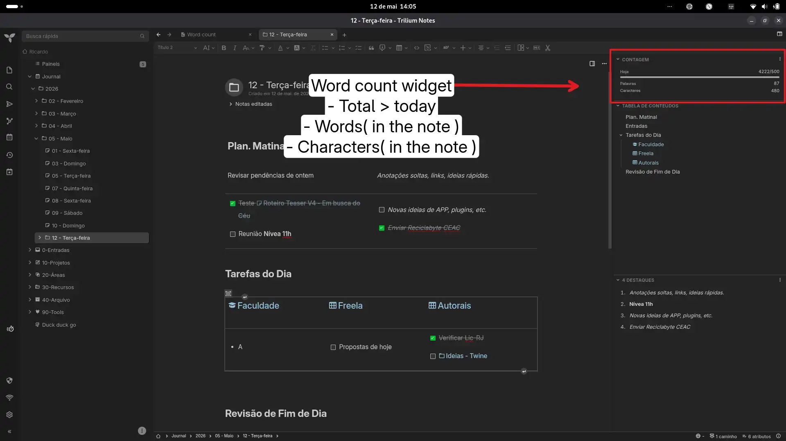

# Word Counter + Daily/Weekly Goal

A compact right-pane panel showing word and character counts for the current note, alongside daily and weekly progress goals.

## Features

* **Live Counting:** Word and character counts for the active text note, updated automatically on note switch and content save (debounced).
* **Daily Goal Tracking:** Set a daily word goal using labels (e.g., `#dailyGoal=1000`). Default is 500 words.
* **Weekly Goal Tracking:** Optional `#weeklyGoal=N` label (ISO week, Monday to Sunday). Default is 3500 words.
* **Baseline + delta semantics:** The first read of a note in the period only sets its baseline; after that, **only real growth counts** ("words written"). Opening an old long note does not credit its size, and shrinking text never subtracts.
* **Goal feedback:** When a goal is reached, the row gets a ✓ **goal reached** badge, the accent color, a `role="status"` announcement and `aria-valuetext` on the progress bar.
* **Accessible bars:** Both bars are `role="progressbar"` with `aria-valuenow/max`, themed for light/dark themes and with `prefers-reduced-motion` support.
* **Bilingual UI (PT/EN):** Follows Trilium's interface language (`locale`).
* **Lean storage:** Per-day/per-week keys are pruned automatically (14 days / 8 weeks); a corrupt payload is preserved and reported in the console.

## Installation

1. Create a `JS Frontend` note in Trilium.
2. Paste the code or import the `.zip`.
3. Add the label: `#widget`.
4. *(Optional)* Add the label `#dailyGoal=N` and/or `#weeklyGoal=N` (on the note or an inheritable ancestor). Reload Trilium (`Ctrl+R` / `Cmd+R`).

## Notes & limitations

* Counting is done on the note text: characters are shown **without spaces** (the tooltip shows both values); entities (`&nbsp;`, `&amp;`) are decoded, and script/style are ignored.
* The goal comes from the **active note** (including inheritable labels); different notes can use different goals.
* Progress lives in this installation's `localStorage` (`wc-YYYY-MM-DD`, `wcw-YYYY-WW`); it is not synced between devices, and editing a note in a non-active split is counted when the note becomes active.
* Character counts use code points (an emoji counts as 1).
* Storage migration: old payloads (max-per-note) are converted on first read — the previous total is preserved and future increments follow the baseline+delta rule.

## Tests

```bash
bun test-wordcount.js   # pure functions: entities, words/chars, goals, baseline+delta, pruning
bun test-smoke.js       # Chrome headless: boot PT/EN, delta, goal hit, error/protected, legacy migration
```

## What's New (audit round, 2026-09)

* **Correct counting:** HTML entities are decoded (`&nbsp;` is no longer a word/6 characters) and `a < b` survives; script/style content is ignored.
* **Honest progress:** max-per-note replaced by baseline + positive delta per note ("words written").
* **Events fixed:** code notes are no longer counted while the widget is hidden; the note id is captured before the async read (no more misattributed words); events are debounced with a trailing run.
* **Storage hardened:** helpers with try/catch, payload validation and migration, automatic pruning of old keys.
* **UI:** weekly bar is now visible in every theme (it used a background token with opacity), bars expose ARIA, goal-hit feedback, error/protected/skeleton states, locale-aware numbers, i18n PT/EN.
* **API:** `getNoteComplement()` (deprecated in 0.106) replaced by `getContent()`.

## Original link
[https://github.com/orgs/TriliumNext/discussions/9711](https://github.com/orgs/TriliumNext/discussions/9711)

### Images  


