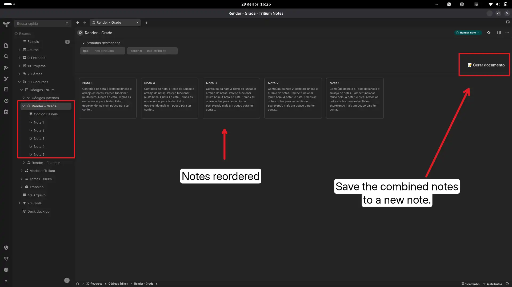
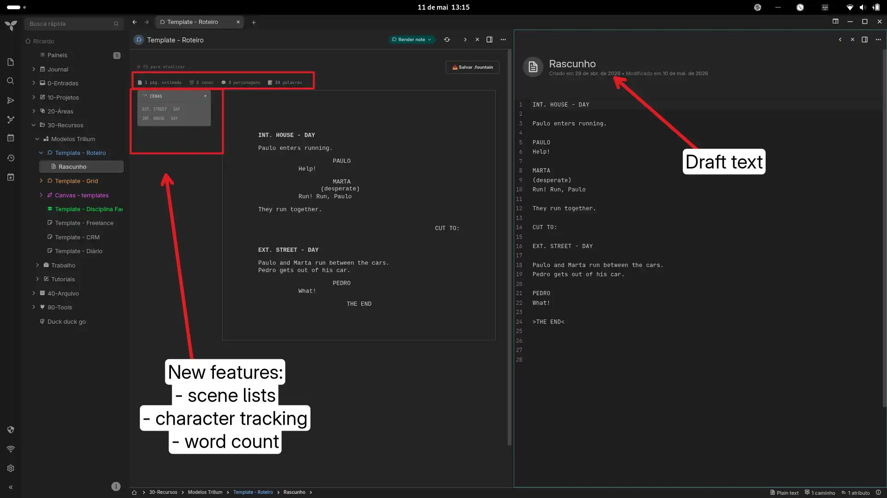

# Custom Scripts for Writers

Two fully functional workflows designed to bridge the gap between Knowledge Management and Content Creation inside Trilium.

## 1. Longform Compiler (Grid View)
Visually organize and compile smaller atomic notes into one master document.
* **Drag & Drop:** Generates a visual grid of child notes that you can reorder (drop before/after a card, or on the empty area to send it to the end).
* **Persistence:** Your custom order is preserved even after a reload (`#gridOrder` label).
* **Click to open:** Clicking a card opens the note.
* **Word count per card.**
* **Compilation:** A single click generates a consolidated master note. The compiled note is created as a child with the `#compiledDoc` label, stays hidden from the grid and is **updated in place** on the next run (no duplicate documents).
* Script notes (JS/CSS) are ignored by the grid.

## 2. Fountain Screenplay Renderer
For audiovisual scriptwriters.
* **Standard Formatting:** Displays your note text beautifully formatted as a standard screenplay using Fountain syntax — accented character names (JOÃO, ANTÔNIO, LUÍSA), dual dialogue, title page, sections, synopsis and page breaks (`===`).
* **Advanced Tracking:** WGA-style page estimate (~55 lines/page), estimated duration, scene list with active-scene highlight, per-character line counts and dialogue ratio.
* **Export:** Dedicated buttons to download a `.fountain` file and a **📄 PDF** — a real A4 PDF generated in-app (Courier, page numbers, `===` page breaks, accented characters) with no print dialog and no printer needed, so it works on the desktop app too. A **🖨 Imprimir** button (browser only) opens the browser print dialog.
* **Draft picker:** With multiple candidate notes, a selector chooses the draft; the choice is saved in the `#fountainDraft` label of the render note (you can also tag a draft note itself with `#fountainDraft`).
* **Refresh:** The ⟳ button (or F5) reloads the draft content.

## General Setup
1. Create a "Render Note" and set it as the parent.
2. Add the script itself as a child note, and ensure the Render Note has a `~renderNote` relation pointing to it.
3. Organize your actual content notes as children under the Render Note.

## Labels
| Label | Where | What it does |
|---|---|---|
| `#gridOrder` | Longform Compiler render note | Saved card order (managed automatically) |
| `#compiledDoc` | Compiled child note | Marks the compiled document (hidden from the grid, updated in place) |
| `#fountainDraft` | Fountain render note (value = noteId) or draft note | Chooses the draft note (managed by the selector; can also be set manually on the draft) |

## Original link
[https://github.com/orgs/TriliumNext/discussions/9494](https://github.com/orgs/TriliumNext/discussions/9494)

### Images  

